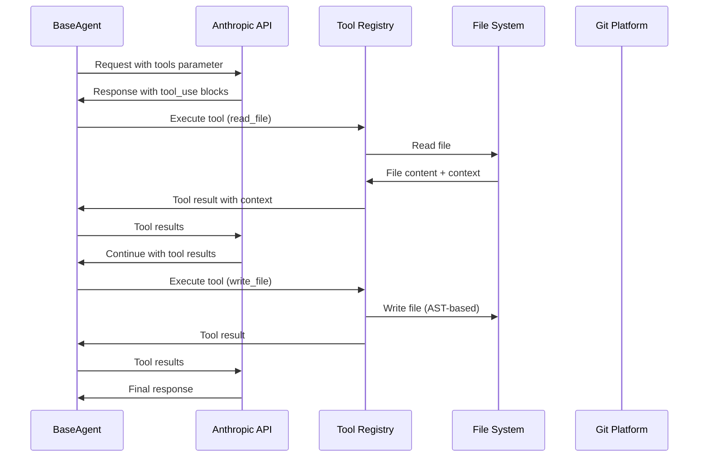
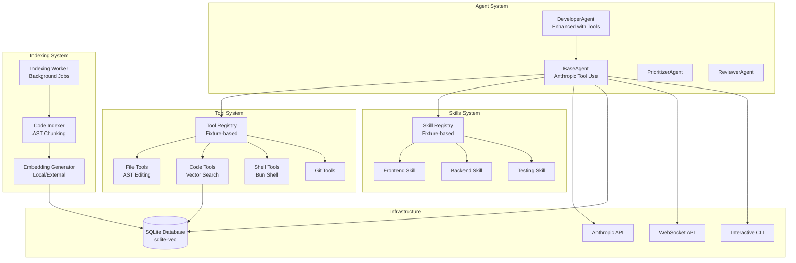

# ADR-024: Nonlinear Agent API with Anthropic Tool Use System

---
**Metadata:**
- **ID**: ADR-024
- **Status**: Proposed
- **Date**: 2025-01-27
- **Tags**: [architecture, ai, automation, nonlinear, tooling]
- **Impact Areas**: [nonlinear]
- **Decision Type**: architecture_pattern
- **Related Decisions**: [ADR-021, ADR-003, ADR-004, ADR-006, ADR-023]
- **Supersedes**: []
- **Superseded By**: []
---

## Context

Nonlinear's existing agent system (ADR-021) uses a simple LLM interaction pattern where agents receive prompts and return text responses. The DeveloperAgent currently uses basic file operations (full-file replacement) and manual JSON parsing of LLM responses to extract implementation plans.

**Current Limitations:**
- File editing is inefficient (full-file replacement instead of AST-based edits)
- No structured tool system for reusable capabilities
- Manual parsing of LLM responses for tool calls
- Limited source code awareness (only reads package.json and README)
- No interactive CLI for debugging agent reasoning
- Tools and skills are hardcoded in agent classes, not configurable

**Requirements:**
- Efficient file editing with AST manipulation (not full-file replacement)
- Structured tool system that agents can use programmatically
- Full source code awareness for better context
- Interactive CLI to follow agent reasoning in real-time
- Fixture-based tools/skills that can be configured per agent
- Direct control over agents (no abstraction layers)
- Integration with existing Nonlinear ticket workflow

**Alternatives Considered:**

1. **Cursor Cloud Agents API**: External service that manages agents
   - ❌ Doesn't integrate with Nonlinear's ticket system
   - ❌ Requires external API keys and service dependency
   - ❌ Violates "direct control" principle
   - ❌ Would need bidirectional sync between Nonlinear tickets and Cursor agents

2. **Home-brewed tool system without Anthropic tool use**: Manual parsing of LLM responses
   - ❌ More complex to implement
   - ❌ Less efficient (parsing text vs native API support)
   - ❌ Reinventing functionality Anthropic already provides

3. **Anthropic Native Tool Use API**: Use Anthropic's built-in tool use capabilities
   - ✅ Already using Anthropic API
   - ✅ Native support for structured tool calling
   - ✅ Efficient (no manual parsing needed)
   - ✅ Direct control over tool execution
   - ✅ Can integrate deeply with Nonlinear's architecture

## Decision

Enhance Nonlinear's agent system with an **Anthropic Native Tool Use API** integration, featuring:

### 1. **Anthropic Tool Use Integration**

Use Anthropic's native `tools` parameter and `tool_use` content blocks instead of manual text parsing:

- Agents send tool definitions to Anthropic API
- Anthropic returns structured `tool_use` blocks
- Agents execute tools and return results
- Anthropic continues conversation with tool results
- No manual JSON parsing or text extraction needed

**Benefits:**
- Efficient: Anthropic optimizes tool selection and execution
- Reliable: Structured API responses vs parsing text
- Extensible: Easy to add new tools without changing parsing logic

### 2. **Fixture-Based Tool System**

Tools and skills loaded from fixtures at startup, similar to documentation fixtures:

**Structure:**
```
lib/fixtures/
├── tools/
│   ├── index.ts              # Tool registry loader
│   ├── file.ts               # File operations (TypeScript compiler API)
│   ├── code.ts               # Code analysis (TypeScript compiler API)
│   ├── git.ts                # Git operations (Bun Shell)
│   ├── test.ts               # Test execution (Bun Shell)
│   └── shell.ts              # Shell operations (Bun Shell)
└── skills/
    ├── index.ts              # Skill registry loader
    ├── frontend.ts           # Frontend expertise
    ├── backend.ts            # Backend expertise
    └── testing.ts            # Testing expertise
```

**Configuration:**
- Agents can specify which tools/skills to load via config
- Tools/skills are TypeScript modules, not hardcoded
- Easy to add new tools/skills without modifying agent classes

### 3. **Enhanced File Editing**

Replace simple file replacement with AST-based editing:

- Use Bun's TypeScript compiler (Go version) for AST manipulation
- Support unified diff application
- Validate changes before applying
- Provide maximum context (imports, exports, related files) with minimal output

**Tools:**
- `read_file`: Read file with syntax context and related file hints
- `write_file`: Write file using AST-based editing when possible
- `apply_diff`: Apply unified diff to file
- `search_files`: Search files by pattern or content

### 4. **Bun Shell Integration**

Use Bun's native shell API (`import {$} from 'bun'`) for all shell operations:

- No external shell libraries needed
- Cross-platform support built-in
- Safe command execution (Bun Shell escapes by default)
- Efficient execution

**Tools:**
- `run_command`: Execute shell command with Bun Shell
- `run_tests`: Run test suite with Bun
- `lint_code`: Run linter with optional auto-fix

### 5. **Interactive CLI**

Real-time reasoning display for debugging and monitoring:

- Stream agent reasoning as it happens
- Show tool execution in real-time
- Display results and errors immediately
- Similar to Cursor CLI/Claude Code experience

**CLI Command:**
```bash
nonlinear agent run <ticket-id> --interactive
```

### 6. **Source Code Awareness with Vector Search**

Build comprehensive source code context using vector embeddings:

- **Semantic code search**: Find similar functions, classes, or patterns
- **Code embeddings**: Store code chunks (functions, classes) as embeddings
- **Vector search integration**: Use existing sqlite-vec infrastructure
- **Background indexing**: Index code files asynchronously without blocking
- **File tree analysis**: Dependency mapping and import/export relationships

**Code Embedding Strategy:**
- Index code files when repository is registered or files change
- Chunk code by semantic units (functions, classes, interfaces)
- Store embeddings in `code_embeddings` table using sqlite-vec
- Use file hash for cache invalidation (skip unchanged files)
- Background worker processes indexing jobs asynchronously

**Vector Search Tool:**
- `search_code`: Semantic code search using vector similarity
- `find_similar_code`: Find code similar to given snippet
- Integrates with existing `unifiedVectorSearch` infrastructure

## Architecture Diagram

### Tool Use Flow



### Component Architecture



## Consequences

### Positive

- **Efficient Tool Execution**: Anthropic's native tool use is optimized for tool calling
- **Structured Responses**: No manual parsing of LLM text responses
- **Extensible**: Easy to add new tools/skills via fixtures
- **Better File Editing**: AST-based editing is more precise than full-file replacement
- **Source Code Awareness**: Agents have full context of codebase structure
- **Interactive Debugging**: CLI allows real-time monitoring of agent reasoning
- **Direct Control**: Full control over tool execution and agent behavior
- **Integration**: Deeply integrated with Nonlinear's ticket workflow
- **Modern Tooling**: Uses Bun Shell and TypeScript compiler API (no external dependencies)

### Negative

- **Implementation Complexity**: Requires building tool system, fixture loading, CLI, and indexing worker
- **Learning Curve**: Developers need to understand Anthropic tool use API
- **Token Usage**: Tool definitions consume tokens in API calls
- **Maintenance**: Tool system requires maintenance as tools evolve
- **Testing**: More complex testing (tools, skills, API integration, indexing)
- **Indexing Overhead**: Code embeddings require storage space and indexing time
- **Embedding Quality**: Local embeddings may have lower quality than specialized code models

## Mitigation Strategies

### 1. **Implementation Phasing**

Start small and iterate:
- Phase 1: Basic tool system + Anthropic integration
- Phase 2: Enhanced file editing
- Phase 3: Interactive CLI
- Phase 4: Skills system
- Phase 5: Comprehensive testing

### 2. **Tool Efficiency**

- Keep tool descriptions concise but informative
- Use context maximization (rich context, minimal output)
- Cache tool results when appropriate
- Batch tool executions when possible

### 3. **Error Handling**

- Comprehensive error handling in tool execution
- Fallback to simpler operations if AST editing fails
- Log all tool executions for debugging
- Graceful degradation if Anthropic tool use fails

### 4. **Testing Strategy**

- Unit tests for each tool
- Integration tests for tool execution
- End-to-end tests for agent workflows
- Mock Anthropic API responses for testing

### 5. **Source Code Embeddings Strategy**

**Indexing Architecture:**
- Background worker processes indexing jobs asynchronously
- Non-blocking repository registration (queue indexing jobs)
- File hash validation prevents re-indexing unchanged files
- Progress tracking via indexing_jobs table

**Provider Strategy (Local-First):**
- Default: Local provider (`@xenova/transformers`) for all embeddings
- Optional: External providers (Voyage AI, OpenAI) for better quality
- Query performance: Local is faster (no network latency)
- Indexing performance: External can be faster (parallel API calls)
- Cost: Local is free, external costs money

**sqlite-vec Sufficiency:**
- sqlite-vec provides same core functionality as Chroma
- Vector storage, similarity search, metadata filtering
- Better integration with SQLite database (joins, transactions)
- No external service dependency
- Sufficient for Nonlinear's needs (single-file database)

## Implementation Notes

### Tool Interface

```typescript
interface Tool {
  name: string
  description: string
  parameters: Array<{
    name: string
    type: string
    description: string
    required?: boolean
  }>
  execute: (params: Record<string, unknown>, context: ToolContext) => Promise<ToolResult>
}

interface ToolResult {
  success: boolean
  data?: unknown
  error?: string
  context?: {
    filesAffected?: string[]
    changesSummary?: string
    relatedFiles?: string[]
    adrRelevant?: string[]
  }
}
```

### Anthropic Tool Use Loop

```typescript
protected async respondWithTools(
  systemPrompt: string,
  userMessage: string,
  maxTokens = 4096
): Promise<string> {
  const anthropicTools = Object.values(this.tools).map(toolToAnthropic)
  const messages: Array<{role: 'user' | 'assistant', content: unknown}> = [
    {role: 'user', content: userMessage}
  ]

  while (true) {
    const response = await fetch('https://api.anthropic.com/v1/messages', {
      method: 'POST',
      headers: {
        'anthropic-version': '2023-06-01',
        'content-type': 'application/json',
        'x-api-key': this.apiKey,
      },
      body: JSON.stringify({
        model: this.model,
        max_tokens: maxTokens,
        system: systemPrompt,
        messages,
        tools: anthropicTools, // Anthropic native tool support
      }),
    })

    const data = await response.json()

    // Handle tool_use content blocks
    const toolUses = data.content.filter((c: {type: string}) => c.type === 'tool_use')
    if (toolUses.length === 0) {
      // Final text response
      return data.content.find((c: {type: string}) => c.type === 'text')?.text || ''
    }

    // Execute tools and add results
    const toolResults = await Promise.all(
      toolUses.map(async (toolUse) => {
        const tool = this.tools[toolUse.name]
        const result = await tool.execute(toolUse.input, this.buildToolContext())
        return {
          tool_use_id: toolUse.id,
          content: JSON.stringify(result),
        }
      })
    )

    // Continue conversation with tool results
    messages.push({role: 'assistant', content: data.content})
    messages.push({role: 'user', content: toolResults})
  }
}
```

### Fixture Loading Pattern

```typescript
// lib/fixtures/tools/index.ts
export function loadTools(agentConfig?: {tools?: string[]}): Record<string, Tool> {
  if (!agentConfig?.tools) {
    return tools // Load all tools
  }

  // Load only specified tools
  const loaded: Record<string, Tool> = {}
  for (const toolName of agentConfig.tools) {
    if (tools[toolName]) {
      loaded[toolName] = tools[toolName]
    }
  }
  return loaded
}
```

### Bun Shell Usage

```typescript
import {$} from 'bun'

// Execute command with Bun Shell
const result = await $`bun test ${testPath}`
  .cwd(repositoryPath)
  .quiet()

// Safe command execution (Bun Shell escapes by default)
const output = await $`echo ${userInput}`.text() // Safe!
```

### TypeScript Compiler API Usage

```typescript
// Use Bun's TypeScript compiler for AST manipulation
// Bun includes TypeScript compiler (Go version) - no external dependencies

// Parse TypeScript source
const sourceFile = await Bun.file(filePath).text()
const ast = parseTypeScript(sourceFile)

// Extract structure
const exports = extractExports(ast)
const imports = extractImports(ast)
const functions = extractFunctions(ast)

// Apply AST edits
const edited = applyASTEdits(ast, edits)
await Bun.write(filePath, edited)
```

### Source Code Embeddings Architecture

**Database Schema:**

```sql
-- Code embeddings table (uses sqlite-vec)
CREATE VIRTUAL TABLE code_embeddings USING vec0(
    embedding float[384],  -- Local model dimension (configurable)
    repository_id TEXT NOT NULL,
    file_path TEXT NOT NULL,
    file_hash TEXT NOT NULL,  -- For cache invalidation
    chunk_index INTEGER NOT NULL,
    chunk_type TEXT,  -- 'function', 'class', 'interface', etc.
    chunk_name TEXT,  -- Function/class name
    chunk_text TEXT NOT NULL,
    start_line INTEGER,
    end_line INTEGER,
    metadata TEXT  -- JSON with additional context
);

-- Indexing jobs table
CREATE TABLE indexing_jobs (
    id TEXT PRIMARY KEY,
    type TEXT NOT NULL,  -- 'code', 'doc', 'ticket'
    repository_id TEXT,
    file_path TEXT,
    doc_id TEXT,
    ticket_id TEXT,
    status TEXT NOT NULL,  -- 'pending', 'processing', 'completed', 'failed'
    created_at INTEGER NOT NULL,
    started_at INTEGER,
    completed_at INTEGER,
    error TEXT,
    FOREIGN KEY (repository_id) REFERENCES repositories(id)
);
```

**Background Indexing Worker:**

```typescript
// lib/indexing/worker.ts
class IndexingWorker {
  private queue: IndexingJob[] = []
  private processing = false
  private maxConcurrent = 3

  async addJob(job: Omit<IndexingJob, 'id' | 'status' | 'created_at'>) {
    // Add to database and queue
    const indexingJob = {
      ...job,
      id: randomId(),
      status: 'pending',
      created_at: Date.now(),
    }

    db.prepare(`
      INSERT INTO indexing_jobs (id, type, repository_id, file_path, status, created_at)
      VALUES (?, ?, ?, ?, ?, ?)
    `).run(...)

    this.queue.push(indexingJob)
    this.processQueue() // Non-blocking
  }

  private async processQueue() {
    if (this.processing) return
    this.processing = true

    while (this.queue.length > 0) {
      const jobs = this.queue.splice(0, this.maxConcurrent)
      await Promise.all(jobs.map(job => this.processJob(job)))
    }

    this.processing = false
  }

  private async processJob(job: IndexingJob) {
    // Update status to processing
    // Generate embeddings
    // Store in code_embeddings table
    // Update status to completed/failed
  }
}
```

**Code Indexing:**

```typescript
// lib/docs/code-embeddings.ts
export async function indexCodeFile(
  repositoryId: string,
  filePath: string
): Promise<void> {
  // 1. Read file and calculate hash
  const code = await Bun.file(filePath).text()
  const fileHash = await calculateFileHash(filePath)

  // 2. Check cache (skip if unchanged)
  const cached = db.prepare(`
    SELECT file_hash FROM code_embeddings
    WHERE repository_id = ? AND file_path = ?
  `).get(repositoryId, filePath)

  if (cached?.file_hash === fileHash) {
    return // Already indexed, skip
  }

  // 3. Delete old embeddings
  db.prepare(`
    DELETE FROM code_embeddings
    WHERE repository_id = ? AND file_path = ?
  `).run(repositoryId, filePath)

  // 4. Chunk code by semantic units
  const chunks = chunkCode(code, filePath)

  // 5. Generate embeddings (default: local provider)
  const chunksWithEmbeddings = await Promise.all(
    chunks.map(async (chunk) => ({
      ...chunk,
      embedding: await generateCodeEmbedding(chunk.text),
    }))
  )

  // 6. Store embeddings
  await storeCodeEmbeddings(repositoryId, filePath, fileHash, chunksWithEmbeddings)
}

export async function searchCode(
  query: string,
  repositoryId: string,
  options?: {limit?: number; fileType?: string}
): Promise<CodeSearchResult[]> {
  // 1. Generate embedding for QUERY (local provider - fast, no network)
  const queryEmbedding = await generateCodeEmbedding(query, 'query')

  // 2. Search against STORED embeddings
  const results = db.prepare(`
    SELECT * FROM code_embeddings
    WHERE repository_id = ?
      AND embedding MATCH ?
    ORDER BY distance ASC
    LIMIT ?
  `).all(repositoryId, JSON.stringify(Array.from(queryEmbedding)), options?.limit || 10)

  return results
}
```

**Code Chunking:**

```typescript
// lib/docs/code-chunking.ts
export interface CodeChunk {
  index: number
  text: string
  type: 'function' | 'class' | 'interface' | 'type' | 'constant' | 'other'
  name?: string
  filePath: string
  startLine: number
  endLine: number
}

export function chunkCode(
  code: string,
  filePath: string,
  maxChunkSize: number = 1000
): CodeChunk[] {
  // Parse AST to extract semantic units
  const ast = parseTypeScript(code)

  const chunks: CodeChunk[] = []

  // Extract functions
  const functions = extractFunctions(ast)
  for (const func of functions) {
    chunks.push({
      index: chunks.length,
      text: code.substring(func.start, func.end),
      type: 'function',
      name: func.name,
      filePath,
      startLine: func.startLine,
      endLine: func.endLine,
    })
  }

  // Extract classes, interfaces, etc.
  // ...

  return chunks
}
```

**Embedding Provider Configuration:**

```typescript
// lib/docs/embeddings.ts - Enhanced
export async function generateEmbedding(
  text: string,
  purpose: 'indexing' | 'query' = 'query',
  contentType: 'doc' | 'ticket' | 'code' = 'doc'
): Promise<Float32Array> {
  // Default: Local provider (fast, free)
  let provider = config.embeddings.provider || 'local'

  // Optional: Use external provider for indexing (better quality, costs money)
  if (purpose === 'indexing' && config.embeddings.indexingProvider) {
    provider = config.embeddings.indexingProvider
  }

  // Optional: Use code-specific provider
  if (contentType === 'code' && config.embeddings.codeProvider) {
    provider = config.embeddings.codeProvider
  }

  // Generate with selected provider
  if (provider === 'local') {
    return await generateLocalEmbedding(text)
  }
  // ... external providers
}

// Default configuration (local-first)
{
  "embeddings": {
    "provider": "local",  // Default: Local provider
    "indexingProvider": null,  // Optional: External for indexing
    "queryProvider": "local",  // Always local for queries (fast)
    "codeProvider": null,  // Optional: Code-specific provider
    "dimension": 384  // Local model dimension
  }
}
```

**Repository Registration (Non-Blocking):**

```typescript
// api/repositories.ts
wsManager.api.post('/api/repositories', async(ctx, req) => {
  // 1. Create repository (fast, no blocking)
  const repoId = randomId()
  db.prepare(`INSERT INTO repositories (...) VALUES (...)`).run(...)

  // 2. Queue indexing jobs (non-blocking)
  const codeFiles = await findCodeFiles(repoPath)
  for (const file of codeFiles) {
    indexingWorker.addJob({
      type: 'code',
      repositoryId: repoId,
      filePath: file,
    })
  }

  // 3. Return immediately
  return {
    repository: {...},
    indexingQueued: codeFiles.length,
    indexingStatus: 'queued'
  }
})
```

## Related Decisions

- **ADR-021**: Nonlinear agent system foundation
- **ADR-003**: Bun runtime (enables Bun Shell and TypeScript compiler)
- **ADR-004**: WebSocket architecture (for real-time agent updates)
- **ADR-006**: WebSocket-first communication (for interactive CLI)
- **ADR-023**: Vector search infrastructure (sqlite-vec integration)

## Future Considerations

- **Tool Marketplace**: Allow users to create and share custom tools
- **Skill Composition**: Agents could combine multiple skills
- **Tool Caching**: Cache tool results to reduce API calls
- **Streaming Tool Results**: Stream tool execution results in real-time
- **Tool Validation**: Validate tool parameters before execution
- **Tool Metrics**: Track tool usage and performance
- **Multi-Agent Tool Sharing**: Agents could share tool execution results
- **Hybrid Embedding Providers**: Use external providers for indexing, local for queries
- **Incremental Indexing**: Only re-index changed files (file hash validation)
- **Indexing Prioritization**: Prioritize indexing for active repositories
- **Embedding Quality Metrics**: Track search quality and adjust provider strategy

## Decision Pattern

**Pattern Name**: Architecture Pattern (AI Agent Tool System)

**When to Apply This Pattern:**
- Building AI agents that need structured tool execution
- Agents require efficient file operations and code analysis
- Need for extensible tool system without modifying agent code
- Desire for direct control over agent behavior
- Integration with existing LLM provider (Anthropic)

**When NOT to Apply:**
- Simple agent workflows that don't need tools
- Agents that only need text generation (no tool execution)
- External agent services that handle tool execution
- Projects without LLM integration

**Key Questions to Ask:**
1. Do agents need structured tool execution?
2. Should tools be configurable per agent?
3. Do we need efficient file editing capabilities?
4. Is source code awareness important?
5. Do we need interactive debugging capabilities?
6. Should we use LLM provider's native tool support?

**Decision Criteria:**
- **Efficiency**: 9/10 - Anthropic tool use is optimized for tool calling
- **Extensibility**: 10/10 - Fixture-based system allows easy tool addition
- **Integration**: 10/10 - Deeply integrated with Nonlinear architecture
- **Control**: 10/10 - Full control over tool execution
- **Maintainability**: 8/10 - Tool system requires maintenance but is well-structured
- **Performance**: 9/10 - Native API support is efficient

**Success Metrics:**
- Agents can efficiently edit files using AST manipulation
- Tools provide maximum context with minimal output
- Interactive CLI shows real-time agent reasoning
- New tools can be added via fixtures without code changes
- Tool execution is reliable and well-tested
- Agent workflows complete successfully with tool use
- Code embeddings enable semantic code search
- Indexing completes without blocking repository operations
- Query performance is fast (local provider, no network latency)

## Rationale Chain

**Primary Reasoning:**
1. Nonlinear agents need efficient tool execution for file operations and code analysis
2. Current system uses inefficient full-file replacement and manual parsing
3. Anthropic provides native tool use API that eliminates parsing overhead
4. Fixture-based tool system enables extensibility without code changes
5. Bun Shell and TypeScript compiler provide modern, efficient tooling
6. Interactive CLI enables debugging and monitoring of agent reasoning
7. Deep integration with Nonlinear's ticket workflow maintains direct control

**Trade-off Analysis:**
- **Accepted Complexity**: Building tool system, fixture loading, CLI, and Anthropic integration
- **Gained Benefit**: Efficient tool execution, extensible system, better file editing, source code awareness
- **Reasoning**: Benefits of structured tool system outweigh implementation complexity
- **Mitigation**: Phased implementation reduces risk, comprehensive testing ensures reliability

**Assumptions:**
- Anthropic tool use API will remain stable (validated: API is well-documented)
- Bun Shell and TypeScript compiler will meet file operation needs (validated: Bun provides these capabilities)
- Fixture-based loading will scale to many tools (validated: similar pattern works for documentation)
- Interactive CLI will improve developer experience (validated: similar tools like Cursor CLI are popular)
- sqlite-vec provides sufficient functionality (validated: same core features as Chroma, better SQL integration)
- Local embeddings are sufficient for most use cases (validated: local model quality is acceptable)
- Background indexing prevents blocking operations (validated: async pattern works for CI and agents)

---

**Pattern**: This decision establishes the Architecture Pattern for AI agent tool systems - using LLM provider's native tool use API with fixture-based tool loading, enabling efficient and extensible agent capabilities while maintaining direct control over agent behavior.
