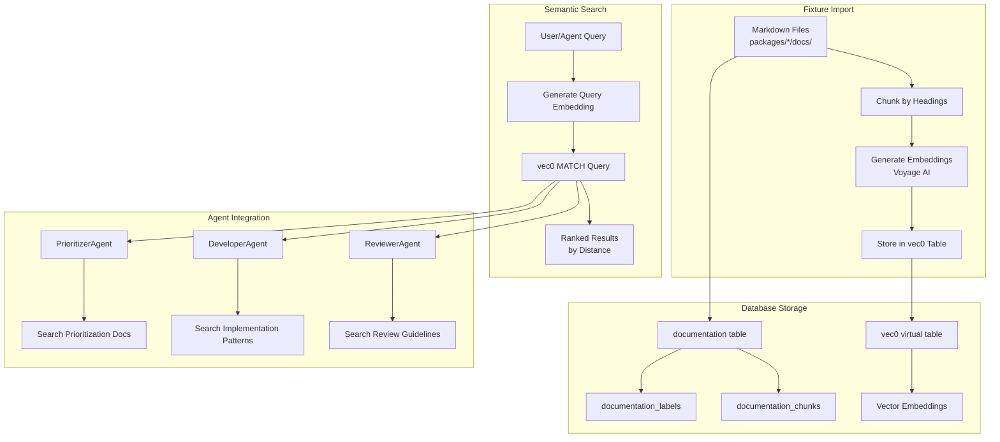
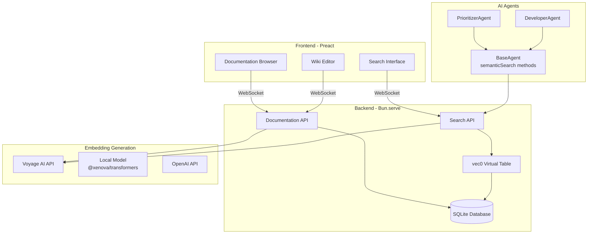

# ADR-023: Wiki System with Vector Search for Agent-Human Collaboration

---
**Metadata:**
- **ID**: ADR-023
- **Status**: Accepted
- **Date**: 2026-02-01
- **Tags**: [architecture, documentation, vector-search, ai, collaboration]
- **Impact Areas**: [nonlinear, malkovich]
- **Decision Type**: architecture_pattern
- **Related Decisions**: [ADR-020, ADR-021]
- **Supersedes**: [ADR-020]
- **Superseded By**: []
---

## Context

The Garage44 monorepo previously used Malkovich to serve documentation as static markdown files. However, this approach had limitations:

**Problems with Filesystem-Based Docs:**
- Agents cannot easily read or write documentation
- No semantic search capabilities for finding relevant context
- Documentation is not integrated with project management (tickets, agents)
- Difficult to provide role-based or context-specific documentation
- No way to track documentation changes or collaborate dynamically

**Requirements:**
- Move documentation from filesystem to database for agent accessibility
- Enable semantic search across documentation and tickets
- Support agent-human collaboration on documentation
- Provide public-facing documentation entry point
- Allow role-based documentation filtering (product owner, developer, etc.)
- Integrate documentation into agent decision-making (prioritization, development)
- Maintain fixture system for importing existing markdown docs

**Key Challenges:**
- Choosing vector database solution (local vs cloud)
- Embedding generation (API vs local models)
- Balancing public access with authenticated editing
- Ensuring documentation stays in sync with codebase
- Providing intuitive wiki-style editing interface

## Decision

Integrate a wiki system into Nonlinear with vector search capabilities, replacing Malkovich's static documentation approach:

### 1. **Database-Backed Documentation**

**Schema:**
- `documentation` table: Stores doc content, path, title, author, timestamps
- `documentation_labels` junction table: Links docs to tags (reuses ticket tag system)
- `documentation_chunks` table: Metadata for chunked content
- `ticket_embeddings` table: Stores ticket embedding metadata

**Path Convention:**
- Workspace-level: `workspaces/{workspace-name}/overview`
- Package-level: `workspaces/{workspace-name}/packages/{package-name}/overview`
- Nested paths: `workspaces/{workspace-name}/packages/{package-name}/architecture/adr-001`

**Tag System:**
- Reuses existing `label_definitions` table (shared with tickets)
- Preset role tags: `role:product-owner`, `role:developer`, `role:designer`, `role:ux`, `role:qa`
- Preset type tags: `type:adr`, `type:rules`, `type:guide`, `type:api`, `type:config`, `type:deployment`
- Tags use hyphens only (validated on entry)
- Preset tags are non-editable

### 2. **Vector Search with sqlite-vec**

**Technology Choice:**
- **sqlite-vec**: Open-source SQLite extension for vector similarity search
- Local solution, no external service dependencies
- Integrates seamlessly with existing SQLite database
- Uses `vec0` virtual table for efficient vector storage

**Vector Storage:**
- `vec_content` virtual table: Stores embeddings with metadata
- 1024 dimensions (Voyage AI voyage-3 model)
- Chunked documentation for better semantic matching
- Unified storage for both docs and tickets

**Search Capabilities:**
- Semantic search across documentation chunks
- Semantic search across tickets (title + description)
- Unified search combining both docs and tickets
- Tag and workspace filtering
- Distance-based similarity scoring

### 3. **Embedding Generation**

**Default Provider: Voyage AI**
- Model: `voyage-3` (1024 dimensions)
- High-quality embeddings optimized for semantic search
- Fast API response times
- Configurable via `VOYAGE_API_KEY` environment variable

**Configurable Providers:**
- **Voyage AI** (default): Production-ready, high quality
- **Local** (`@xenova/transformers`): `Xenova/all-MiniLM-L6-v2` (384 dimensions)
- **OpenAI** (optional): `text-embedding-3-small` (1536 dimensions)

**Chunking Strategy:**
- Markdown content chunked by headings (##, ###, ####)
- Preserves heading context in each chunk
- Configurable chunk size (default: 1000 chars) and overlap (default: 200 chars)
- Each chunk stored separately with metadata (heading, index)

**Auto-Embedding:**
- Documentation: Embeddings generated automatically on create/update
- Tickets: Embeddings generated automatically on create/update
- Background processing to avoid blocking API responses

### 4. **Fixture System**

**Purpose:**
- Import existing markdown docs from `packages/*/docs/` directories
- Create preset tickets for testing
- Initialize garage44 workspace automatically in development mode

**Behavior:**
- Runs automatically when database is empty (development mode only)
- Scans `packages/*/docs/` directories recursively
- Converts file paths to wiki paths following convention
- Infers tags from file paths (e.g., `/architecture/adr/` → `type:adr`)
- Generates embeddings for all imported docs
- Creates preset tickets with embeddings

**Path Conversion:**
- `packages/expressio/docs/index.md` → `workspaces/garage44/packages/expressio/overview`
- `packages/expressio/docs/architecture/adr-001.md` → `workspaces/garage44/packages/expressio/architecture/adr-001`
- `docs/architecture/adr-001.md` → `workspaces/garage44/architecture/adr-001`

### 5. **Public Access & Navigation**

**Public Documentation:**
- Documentation browser accessible without authentication
- Root path (`/`) redirects to `/docs` (public entry point)
- Planning board visible to non-authenticated users (configurable via `config.public.showPlanning`)

**Navigation:**
- "Documentation" menu item first (before Planning)
- Wiki-style viewer with tree navigation
- Search functionality (text-based, semantic search via API)

**Authentication:**
- Read access: Public (no auth required)
- Write access: Authenticated users only
- Edit button only visible to authenticated users

### 6. **Agent Integration**

**BaseAgent Enhancements:**
- `semanticSearch()`: Unified search across docs and tickets
- `searchDocs()`: Documentation-only search
- `searchTickets()`: Ticket-only search
- `getRelevantDocs()`: Formats search results for agent context

**PrioritizerAgent Integration:**
- Searches for prioritization guidelines before prioritizing tickets
- Filters by `type:prioritization` and `role:product-owner` tags
- Includes relevant documentation in LLM context for better decisions

**Future Agent Usage:**
- DeveloperAgent: Search for implementation patterns and API docs
- ReviewerAgent: Search for code review guidelines and standards
- All agents: Update documentation when patterns change or new decisions are made

### 7. **API Endpoints**

**Documentation CRUD:**
- `GET /api/docs` - List docs (filter by tags, workspace)
- `GET /api/docs/:id` - Get doc by ID
- `GET /api/docs/by-path` - Get doc by path
- `POST /api/docs` - Create doc (authenticated)
- `PUT /api/docs/:id` - Update doc (authenticated)
- `DELETE /api/docs/:id` - Delete doc (authenticated)

**Search:**
- `GET /api/search` - Unified semantic search (docs + tickets)
- `GET /api/docs/search` - Documentation-only semantic search

**Tag Validation:**
- All tag inputs validated (hyphens only, no underscores)
- Preset tags cannot be edited or deleted
- Invalid tags rejected with clear error messages

## Architecture Diagram

### Documentation Flow



### Component Architecture



## Consequences

### Positive

- **Agent Accessibility**: Agents can read and write documentation seamlessly
- **Semantic Search**: Find relevant context using natural language queries
- **Unified Search**: Search across both documentation and tickets semantically
- **Role-Based Context**: Filter documentation by role tags for relevant context
- **Public Documentation**: Visitors can learn about projects without authentication
- **Auto-Embedding**: Embeddings generated automatically, no manual steps
- **Fixture System**: Easy import of existing markdown docs
- **Local Vector DB**: No external service dependencies for vector storage
- **Configurable Embeddings**: Can switch between Voyage AI, local, or OpenAI

### Negative

- **Voyage AI Dependency**: Default embedding provider requires API key and internet
- **Storage Overhead**: Vector embeddings increase database size significantly
- **Chunking Complexity**: Markdown chunking may split related content
- **sqlite-vec Compatibility**: Extension loading may have platform-specific issues
- **Embedding Cost**: Voyage AI API calls incur costs (though minimal per doc)
- **Migration Effort**: Existing markdown docs need to be imported via fixtures

## Mitigation Strategies

### 1. **sqlite-vec Extension Loading**

- Graceful degradation: System works without vector search if extension fails to load
- Platform-specific binaries: sqlite-vec provides platform packages (linux-x64, darwin-arm64, etc.)
- Error handling: Logs warnings but continues operation
- Fallback: Can disable vector search and use text-based search only

### 2. **Embedding Generation**

- Configurable providers: Can switch to local models if API unavailable
- Error handling: Embedding failures don't block doc creation/updates
- Background processing: Embeddings generated asynchronously
- Retry logic: Failed embeddings can be regenerated later

### 3. **Chunking Strategy**

- Heading-based chunking preserves document structure
- Configurable chunk size and overlap for optimal results
- Metadata stored with each chunk (heading, index) for context
- Full document content still accessible for display

### 4. **Cost Management**

- Local embedding option available (no API costs)
- Embeddings only regenerated on content changes
- Batch embedding generation for fixture imports
- Usage monitoring via Voyage AI API response headers

### 5. **Migration Path**

- Fixture system automatically imports existing docs
- Path conversion maintains logical structure
- Tags inferred from file paths automatically
- Can re-run fixtures to update imported docs

## Implementation Notes

### Database Schema

```sql
-- Documentation table
CREATE TABLE documentation (
    id TEXT PRIMARY KEY,
    path TEXT NOT NULL UNIQUE,
    title TEXT NOT NULL,
    content TEXT NOT NULL,
    author_id TEXT NOT NULL,
    created_at INTEGER NOT NULL,
    updated_at INTEGER NOT NULL
);

-- Documentation labels (reuses label_definitions)
CREATE TABLE documentation_labels (
    doc_id TEXT NOT NULL,
    label TEXT NOT NULL,
    PRIMARY KEY (doc_id, label),
    FOREIGN KEY (doc_id) REFERENCES documentation(id) ON DELETE CASCADE,
    FOREIGN KEY (label) REFERENCES label_definitions(name) ON DELETE CASCADE
);

-- Vector content virtual table (sqlite-vec)
CREATE VIRTUAL TABLE vec_content USING vec0(
    embedding float[1024],
    content_type TEXT NOT NULL,
    content_id TEXT NOT NULL,
    chunk_index INTEGER,
    chunk_text TEXT NOT NULL,
    metadata TEXT
);
```

### Preset Tags

**Role Tags:**
- `role:product-owner`
- `role:developer`
- `role:designer`
- `role:ux`
- `role:qa`
- `role:prioritizer`

**Type Tags:**
- `type:prioritization`
- `type:adr`
- `type:rules`
- `type:guide`
- `type:api`
- `type:config`
- `type:deployment`

### Agent Usage Pattern

```typescript
// In PrioritizerAgent
const prioritizationDocs = await this.getRelevantDocs(
    'prioritization guidelines criteria business value technical debt',
    {tags: ['type:prioritization', 'role:product-owner']},
    3
)

// In DeveloperAgent (future)
const implementationPatterns = await this.getRelevantDocs(
    ticket.title + ' ' + ticket.description,
    {tags: ['type:guide', 'type:api']},
    5
)
```

### Fixture Import Logic

1. Check if garage44 workspace exists
2. If not, create workspace
3. Scan `packages/*/docs/` directories
4. For each `.md`/`.mdc` file:
   - Read content
   - Convert path to wiki path
   - Infer tags from path
   - Create doc record
   - Generate embeddings
5. Create preset tickets
6. Generate ticket embeddings

## Related Decisions

- **ADR-020**: Superseded by this decision (moved from filesystem to database)
- **ADR-021**: Extends Nonlinear with wiki and vector search capabilities
- **ADR-001**: Follows monorepo package structure
- **ADR-003**: Uses Bun runtime for backend
- **ADR-004**: Preact frontend with WebSocket

## Future Considerations

- **Documentation Versioning**: Track changes and allow rollback
- **Documentation Templates**: Pre-filled templates for common doc types (ADR, guide, etc.)
- **Documentation Analytics**: Track which docs agents use most
- **Multi-Language Support**: Vector search across multiple languages
- **Documentation Suggestions**: AI suggests documentation updates based on code changes
- **Documentation Generation**: Agents automatically generate docs from code
- **Advanced Filtering**: More sophisticated tag-based filtering and search
- **Documentation Relationships**: Link related docs together
- **Embedding Fine-Tuning**: Fine-tune embeddings on project-specific terminology

## Decision Pattern

**Pattern Name**: Database-Backed Wiki with Vector Search

**When to Apply This Pattern:**
- Need for agent-accessible documentation
- Desire for semantic search capabilities
- Requirement for role-based or context-specific documentation
- Need to integrate documentation with project management
- Want to enable agent-human collaboration on docs

**When NOT to Apply:**
- Simple static documentation needs (use filesystem)
- No AI agent integration required
- Budget constraints prevent embedding API usage
- Documentation rarely changes
- Team prefers markdown files in git

**Key Questions to Ask:**
1. Do agents need to read/write documentation?
2. Is semantic search valuable for finding relevant context?
3. Should documentation be integrated with project management?
4. Do we need role-based or context-specific documentation?
5. What's the cost/benefit of vector embeddings vs text search?
