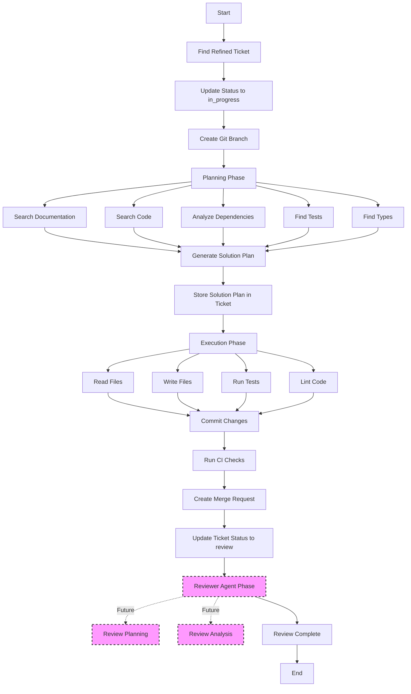
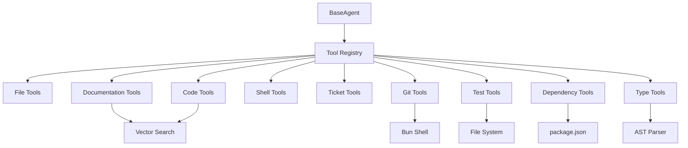

# ADR-027: Developer Agent Tools and Planning Workflow

---
**Metadata:**
- **ID**: ADR-027
- **Status**: Proposed
- **Date**: 2025-02-05
- **Tags**: [architecture, ai, automation, nonlinear, tooling, developer-experience]
- **Impact Areas**: [nonlinear]
- **Decision Type**: architecture_pattern
- **Related Decisions**: [ADR-021, ADR-024, ADR-025, ADR-026]
- **Supersedes**: []
- **Superseded By**: []
---

## Context

Nonlinear's Developer agent (ADR-021, ADR-024) currently has a workflow issue where it attempts to parse JSON from `respondWithTools()` responses, but `respondWithTools()` executes tools directly and returns text, not structured JSON. Additionally, the agent lacks sufficient context-gathering tools to efficiently understand codebases and make informed implementation decisions.

**Current Limitations:**

1. **Workflow Mismatch**: Developer agent calls `respondWithTools()` but then tries to parse JSON plan from the response, which fails because tools execute directly
2. **Limited Context Tools**: Agent has basic file/code search but lacks:
   - Documentation/ADR search capabilities
   - Test discovery and pattern matching
   - Dependency analysis
   - Type system exploration
   - Git history analysis
3. **No Solution Documentation**: No way to distinguish between refined problem description (from Prioritizer) and solution plan (from Developer or other agents)
4. **Inefficient Development**: Agent must manually discover patterns instead of leveraging existing codebase knowledge

**Requirements:**

- Fix developer agent workflow to properly use tools for execution
- Add planning phase that documents solution approach
- Distinguish between problem description and solution plan
- Provide tools for better codebase context and faster development
- Enable agent to learn from existing patterns and documentation

**Alternatives Considered:**

1. **Keep Current JSON Parsing Approach**: Try to force LLM to return JSON plans
   - ❌ Doesn't work with tool execution model
   - ❌ Tools execute directly, can't return structured plans
   - ❌ Requires complex parsing logic

2. **Single-Phase Execution**: Skip planning, go straight to implementation
   - ❌ No documentation of approach
   - ❌ Harder to debug failed implementations
   - ❌ No way to review plan before execution

3. **Two-Phase with Planning Documentation**: Generate plan first, store it, then execute
   - ✅ Documents implementation approach
   - ✅ Separates problem (description) from solution (plan)
   - ✅ Enables review and debugging
   - ✅ Works with tool execution model

4. **Add Context Tools**: Provide specialized tools for codebase understanding
   - ✅ Speeds up development significantly
   - ✅ Reduces redundant code discovery
   - ✅ Leverages existing infrastructure (vector search, file operations)

## Decision

Implement a **Two-Phase Developer Agent Workflow** with **Enhanced Context Tools**:

### 1. **Solution Plan Field**

Add `solution_plan` TEXT field to tickets table to store solution plans separately from refined problem descriptions:

- **`description`**: Refined problem description from Prioritizer agent (what needs to be done)
- **`solution_plan`**: Solution plan from Developer agent or other agents (how it will be solved - may involve development, documentation, design, research, etc.)

**Workflow Evolution:**
The ticket lifecycle follows a clear progression:
1. **Problem** (Prioritizer) → `description` - Refines and clarifies the problem
2. **Solution** (Developer) → `solution_plan` - Plans and implements the solution
3. **Review** (Reviewer) → Future: Review analysis and feedback

This establishes a pattern where each agent phase contributes distinct documentation to the ticket.

**Benefits:**
- Clear separation of problem vs solution
- Generic enough for any ticket type (development, documentation, design, research)
- Enables review of solution approach before execution
- Provides documentation for future reference
- Helps debug failed implementations

### 2. **Two-Phase Workflow**

Refactor Developer agent `process()` method into two phases:

**Phase 1: Planning**
- Agent uses tools to understand codebase (read files, search code, analyze dependencies)
- Agent generates structured solution plan (markdown format)
- Plan stored in ticket's `solution_plan` field
- Agent uses `respondWithTools()` to gather context and generate plan

**Phase 2: Execution**
- Agent uses `respondWithTools()` to execute plan directly
- Tools execute changes (read_file, write_file, run_tests, git operations)
- No JSON parsing - tools handle execution directly
- Agent commits changes and creates merge request

**Key Changes:**
- Remove JSON parsing logic from `process()` method
- Split into two `respondWithTools()` calls: planning and execution
- Store plan between phases in database
- Let tools handle file operations directly (no manual file creation/modification)

### 3. **Enhanced Developer Tools**

Add five new tools to improve agent context and development speed:

#### 3.1. `search_documentation`
- Search ADRs, rules, and project documentation semantically
- Uses existing `searchDocs()` infrastructure
- Parameters: query, labels filter, limit
- Returns formatted documentation with relevance scores

#### 3.2. `find_tests`
- Find existing tests for similar functionality or specific files
- Uses file pattern matching + code search
- Parameters: forFile, forFeature, testType filter
- Returns test files with structure and patterns

#### 3.3. `analyze_dependencies`
- Analyze project dependencies and find where they're used
- Reads package.json and searches for imports
- Parameters: packageName (optional), findUsage flag
- Returns dependency info and usage locations

#### 3.4. `find_types`
- Find TypeScript types, interfaces, and their usages
- Uses AST parsing or regex to find type definitions
- Parameters: typeName, searchPattern, findUsages flag
- Returns type definitions and usage locations

#### 3.5. `analyze_git_history`
- Analyze git history to find similar past implementations
- Uses Bun Shell to run git commands
- Parameters: file, query (commit message search), since (time period)
- Returns commit history and related changes

**Tool Implementation Pattern:**
- All tools follow existing `Tool` interface from ADR-024
- Tools return structured data with context for agent reasoning
- Use existing infrastructure where possible (vector search, file operations)
- Proper error handling and logging

## Implementation

### Database Schema

**File:** `packages/nonlinear/lib/database.ts`

- Add `solution_plan TEXT` column to tickets table CREATE statement
- Update `Ticket` interface to include `solution_plan?: string | null`
- No migration needed (database reset)

### Developer Agent Refactor

**File:** `packages/nonlinear/lib/agent/developer.ts`

**Planning Phase:**
```typescript
// Phase 1: Generate development plan
const planningPrompt = `You are a Developer agent. Analyze the ticket requirements and codebase to create an implementation plan.

Use available tools to:
- Read relevant files to understand codebase structure
- Search for similar implementations
- Analyze dependencies and types
- Review documentation and ADRs
- Find existing tests

Generate a detailed step-by-step implementation plan in markdown format.`

const plan = await this.respondWithTools(planningPrompt, userMessage, 8192, agentContext)

// Store plan in ticket
await updateTicketFromAgent(ticket.id, { solution_plan: plan })
```

**Execution Phase:**
```typescript
// Phase 2: Execute plan
const executionPrompt = `You are a Developer agent. Execute the development plan stored in the ticket.

Follow the plan step by step:
- Use tools to make changes directly
- Run tests after changes
- Fix any issues that arise
- Commit changes when complete

The solution plan is:
${ticket.solution_plan}`

await this.respondWithTools(executionPrompt, 'Execute the plan', 8192, agentContext)
```

### New Tool Files

**Files Created:**
- `packages/nonlinear/lib/fixtures/tools/documentation.ts` - Documentation search tool
- `packages/nonlinear/lib/fixtures/tools/test.ts` - Test discovery tool
- `packages/nonlinear/lib/fixtures/tools/dependency.ts` - Dependency analysis tool
- `packages/nonlinear/lib/fixtures/tools/type.ts` - Type discovery tool
- `packages/nonlinear/lib/fixtures/tools/git.ts` - Extend existing git tools

**Tool Registry:**
- Update `packages/nonlinear/lib/fixtures/tools/index.ts` to export new tools
- Tools automatically available to all agents via `loadTools()`

### API Updates

**File:** `packages/nonlinear/api/tickets.ts`

- Update PUT `/api/tickets/:id` to accept `solution_plan` in updates
- Update GET endpoints to include `solution_plan` in responses
- Update WebSocket broadcasts to include `solution_plan` field

**File:** `packages/nonlinear/lib/agent/ticket-updates.ts`

- Extend `updateTicketFromAgent()` to support `solution_plan` field
- Update ticket query to include `solution_plan` in SELECT

## Consequences

### Positive

1. **Better Documentation**: Clear separation of problem description vs implementation plan
2. **Improved Debugging**: Can review plan before execution, easier to debug failures
3. **Faster Development**: Context tools reduce time spent discovering codebase patterns
4. **Better Code Quality**: Agent learns from existing patterns and documentation
5. **Tool Reusability**: New tools available to all agents, not just Developer
6. **Workflow Fix**: Properly uses tool execution model instead of JSON parsing

### Negative

1. **Additional Database Field**: Requires schema change (mitigated by database reset)
2. **Two-Phase Overhead**: Slightly longer workflow (planning + execution)
3. **Tool Maintenance**: Five new tools to maintain and test
4. **Complexity**: More moving parts in developer agent workflow
5. **Field Naming**: `solution_plan` is generic but may need clarification in UI (e.g., "Solution Plan" vs "Implementation Plan")

### Mitigation Strategies

1. **Database Reset**: No migration needed, clean schema
2. **Planning Value**: Planning phase saves time in execution, net positive
3. **Tool Testing**: Each tool follows established patterns, easier to test
4. **Documentation**: Clear workflow documentation for future maintenance

## Architecture Impact

**Principles Affected:**

- **Agent Tool System** (ADR-024): Extended with new context-gathering tools
- **Developer Experience**: Improved through better tooling and planning workflow
- **Documentation**: Better separation of concerns (problem vs solution)

**System-Wide Changes:**

- **Database Schema**: New `solution_plan` field in tickets table
- **Tool Registry**: Five new tools added to fixture system
- **Agent Workflow**: Two-phase planning + execution pattern
- **API**: New field exposed in ticket endpoints

**Future Constraints:**

- All developer agents should follow two-phase workflow pattern
- New context tools should follow established `Tool` interface
- Solution plans should be stored in tickets for traceability
- Field name `solution_plan` is generic to support any ticket type (development, documentation, design, research)

## Decision Pattern

**When to Apply:**

- Adding new agent types that need planning capabilities
- Creating tools that provide codebase context
- Separating problem analysis from solution implementation
- Documenting implementation approaches for review

**When NOT to Apply:**

- Simple agents that don't need planning (e.g., status checkers)
- Tools that don't provide codebase context
- One-off implementations that don't need documentation

**Success Metrics:**

- Developer agent successfully generates and stores solution plans
- Agent execution time reduced by leveraging context tools
- Solution plans provide useful documentation for debugging
- Tools are reused across multiple agent types
- Field name supports non-development tickets (documentation, design, research)

## AI Prompts

**When Evaluating Similar Decisions:**

1. "Does this agent need a planning phase, or can it execute directly?"
2. "What context tools would help this agent understand the codebase better?"
3. "Should this solution be documented in a plan field or just executed?"
4. "Is this ticket type appropriate for a solution plan (development, documentation, design, research)?"

**Pattern Recognition:**

- If agent needs to understand codebase → use context tools
- If agent generates solution approach → use two-phase workflow
- If separating problem from solution → use separate fields (`description` vs `solution_plan`)
- If ticket type is non-development → still use `solution_plan` (generic name)

**Red Flags:**

- ⚠️ Agent parsing JSON from tool responses → Use tool execution model instead
- ⚠️ Agent manually discovering patterns → Add context tools
- ⚠️ No documentation of approach → Add planning phase

**Consistency Checks:**

- Aligns with ADR-024: Uses established tool system and interface
- Aligns with ADR-025: Works with agent service architecture
- Aligns with ADR-026: Compatible with interactive REPL mode

## Diagrams

### Developer Agent Workflow



**Note:** Reviewer phase shown with dashed lines indicates future enhancement - not implemented in this ADR.

### Tool System Architecture



## Future Considerations

### Reviewer Agent Workflow

The Reviewer agent currently reviews implemented solutions, but following the pattern established here, it may also benefit from a planning phase:

**Current Reviewer Workflow:**
- Reviews merge requests and code changes
- Provides feedback and approval/rejection

**Potential Future Enhancement:**
- **Review Planning Phase**: Reviewer analyzes the solution plan and implementation before detailed code review
  - Understands the solution approach from `solution_plan`
  - Identifies key areas to focus review on
  - Generates review strategy/checklist
  - Could store review plan/analysis in a separate field (e.g., `review_plan` or `review_analysis`)

**Review UI Requirements:**
- Future UI will need to display the complete ticket lifecycle:
  - Problem description (`description`)
  - Solution plan (`solution_plan`)
  - Review analysis (future field)
  - Implementation changes (MR/PR)
- Review UI should allow reviewers to:
  - See solution plan context
  - Provide structured feedback
  - Approve/reject with reasoning
  - Track review progress

**Not Implemented Now:**
- This ADR focuses on Developer agent workflow
- Reviewer enhancements can be addressed in a future ADR
- Database schema can be extended later if needed
- UI can be built incrementally as workflow evolves

## Related

- [ADR-021](./021-nonlinear.md): Nonlinear Agent System - Foundation for agent architecture
- [ADR-024](./024-agent-api-tool-system.md): Agent API with Anthropic Tool Use System - Tool system foundation
- [ADR-025](./025-agent-service-architecture.md): Agent Service Architecture - Process isolation
- [ADR-026](./026-interactive-agent-cli-repl.md): Interactive Agent CLI with REPL Mode - Interactive debugging
