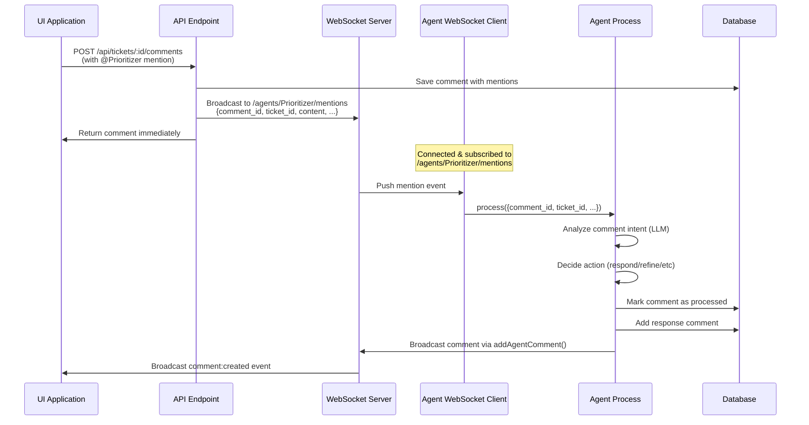

# ADR-028: Agent Mention Processing with WebSocket Push

---
**Metadata:**
- **ID**: ADR-028
- **Status**: Proposed
- **Date**: 2025-02-04
- **Tags**: [architecture, ai, automation, nonlinear, websocket, real-time]
- **Impact Areas**: [nonlinear]
- **Decision Type**: architecture_pattern
- **Related Decisions**: [ADR-021, ADR-006]
- **Supersedes**: []
- **Superseded By**: []
---

## Context

Nonlinear's agent system (ADR-021) currently processes agent mentions (`@Prioritizer`, `@Developer`, etc.) in comments through a synchronous API call. When a user mentions an agent in a comment, the API endpoint directly calls `triggerAgent()`, which processes the mention immediately within the API request handler.

**Current Limitations:**

1. **Synchronous Processing**: Agent processing happens synchronously in the API request, blocking the response until completion
2. **Tight Coupling**: API endpoint is tightly coupled to agent execution, making it difficult to scale or handle agent failures gracefully
3. **No Real-time Communication**: Agent service runs independently but doesn't receive real-time notifications about mentions
4. **Hardcoded Behavior**: Agents always assume mentions are refinement requests, even when users are just asking questions
5. **Polling Inefficiency**: Agent services poll for work at fixed intervals (5 minutes for prioritizer, 10 seconds for developer/reviewer), causing delays and wasted CPU cycles

**Requirements:**

- Decouple agent processing from API requests
- Enable real-time agent responses to mentions
- Allow agents to decide their actions based on comment content (not hardcoded)
- Support multiple agent instances without conflicts
- Provide immediate feedback to users when agents are mentioned
- Handle agent service failures gracefully

**Alternatives Considered:**

1. **Keep Synchronous API Triggering**: Continue calling `triggerAgent()` directly from API
   - ❌ Blocks API response until agent completes
   - ❌ Tight coupling between API and agents
   - ❌ No way to handle agent service being down
   - ❌ Difficult to scale or add retry logic

2. **Database Polling**: Agents poll database for unprocessed mentions
   - ✅ Decouples API from agent processing
   - ✅ Works even if agent service is temporarily down
   - ❌ Introduces latency (up to poll interval)
   - ❌ Wastes CPU cycles checking when nothing new
   - ❌ Not real-time

3. **WebSocket Push**: Agent services connect as WebSocket clients and receive push notifications
   - ✅ Real-time processing (immediate response)
   - ✅ Event-driven (no wasted CPU cycles)
   - ✅ Decouples API from agent processing
   - ✅ Uses existing WebSocket infrastructure
   - ✅ Auto-reconnects if connection drops
   - ✅ Scales well with multiple agent instances

4. **Message Queue (Redis/RabbitMQ)**: Use external message queue for agent notifications
   - ✅ Decoupled architecture
   - ✅ Reliable delivery guarantees
   - ❌ Adds external dependency
   - ❌ More complex setup and maintenance
   - ❌ Overkill for single-server deployment

## Decision

Implement **WebSocket Push Architecture** for agent mention processing:

### 1. **Agent Service WebSocket Client**

Agent services connect to the main Nonlinear service as WebSocket clients:

- **Connection**: Agent service connects to `/ws` endpoint using `WebSocketClient` from `@garage44/common/lib/ws-client`
- **Subscription**: Each agent subscribes to agent-specific topic: `/agents/:agentId/mentions`
- **Event Handling**: On receiving mention event, agent processes immediately via `runAgent()` with mention context
- **No Polling**: Remove all polling mechanisms - agents are event-driven only

**Benefits:**
- Real-time processing (no delay)
- Efficient resource usage (only processes when needed)
- Automatic reconnection handling
- Works with existing WebSocket infrastructure

### 2. **API Endpoint Changes**

Comment creation endpoint (`POST /api/tickets/:id/comments`) changes:

- **Remove**: Direct `triggerAgent()` call
- **Add**: WebSocket broadcast to `/agents/:agentId/mentions` topic for each mentioned agent
- **Keep**: Mention parsing and validation
- **Keep**: Comment storage in database

**Broadcast Payload:**
```typescript
{
  comment_id: string
  ticket_id: string
  comment_content: string
  author_id: string
  author_type: 'agent' | 'human'
  mentions: string[]  // All mentioned agent names
}
```

### 3. **Agent Decision-Making**

Replace hardcoded `refineTicketFromMention()` with intelligent `handleMention()` method:

- **LLM Analysis**: Agent analyzes comment content to determine user intent
- **Action Decision**: Agent decides appropriate action:
  - Question → Respond conversationally
  - Refinement request → Refine ticket description
  - Status check → Provide status update
  - Other requests → Handle contextually
- **Flexible Response**: Agent generates appropriate response and actions based on analysis

**Benefits:**
- Agents adapt to user needs
- More natural conversation flow
- Reduces unnecessary ticket modifications
- Better user experience

### 4. **Database Schema Enhancement**

Add `agent_processed` field to `comments` table:

- **Field**: `agent_processed` TEXT (JSON array of agent IDs)
- **Purpose**: Track which agents have processed a comment
- **Prevents**: Duplicate processing if multiple agent instances exist
- **Index**: Add index on `ticket_id` and `created_at` for efficient queries

### 5. **Implementation Flow**



## Consequences

### Positive

1. **Real-time Responses**: Agents respond immediately to mentions (no polling delay)
2. **Better User Experience**: Users get instant feedback when mentioning agents
3. **Efficient Resource Usage**: Event-driven processing eliminates wasted CPU cycles
4. **Decoupled Architecture**: API and agents are independent, easier to scale and maintain
5. **Intelligent Agents**: Agents adapt to user intent rather than hardcoded behavior
6. **Scalability**: Multiple agent instances can subscribe without conflicts
7. **Resilience**: WebSocket client auto-reconnects if connection drops

### Negative

1. **Agent Service Dependency**: Agent service must be running to process mentions (but mentions are queued in database)
2. **WebSocket Connection Required**: Agent services need network access to main service
3. **Additional Complexity**: More moving parts than synchronous API call

### Neutral

1. **Database Still Used**: Comments stored in database for persistence and recovery
2. **Backward Compatible**: Existing comment structure maintained, just processing changes

## Implementation Details

### Files to Modify

1. **`packages/nonlinear/lib/database.ts`**
   - Add `agent_processed` TEXT column to `comments` table
   - Add index on `ticket_id` and `created_at`

2. **`packages/nonlinear/api/tickets.ts`**
   - Remove `triggerAgent()` call from comment creation endpoint
   - Add WebSocket broadcast to `/agents/:agentId/mentions` for each mentioned agent

3. **`packages/nonlinear/lib/agent/service.ts`**
   - Add WebSocket client connection to main service
   - Subscribe to `/agents/:agentId/mentions` topic
   - Remove polling mechanism (`setInterval`)
   - Handle mention events and trigger agent processing

4. **`packages/nonlinear/lib/agent/prioritizer.ts`** (and similar for other agents)
   - Replace `refineTicketFromMention()` with `handleMention()`
   - Add LLM-based intent analysis
   - Implement flexible action decision logic

5. **`packages/nonlinear/lib/comments/mentions.ts`**
   - Add `markMentionProcessed(commentId: string, agentId: string)` function

### Testing Considerations

- Test with agent service running vs not running
- Test WebSocket reconnection scenarios
- Test multiple mentions in same comment
- Test different comment intents (question, refinement, status check)
- Test concurrent mentions to same agent
- Verify `agent_processed` field updates correctly
- Test agent service startup/shutdown gracefully handles WebSocket connection
- Test multiple agent instances processing same mention (should only process once)

## References

- ADR-021: Nonlinear - AI-Powered Automated Project Management
- ADR-006: WebSocket Migration
- `packages/common/lib/ws-client.ts` - WebSocket client implementation
- `packages/common/lib/ws-server.ts` - WebSocket server implementation
