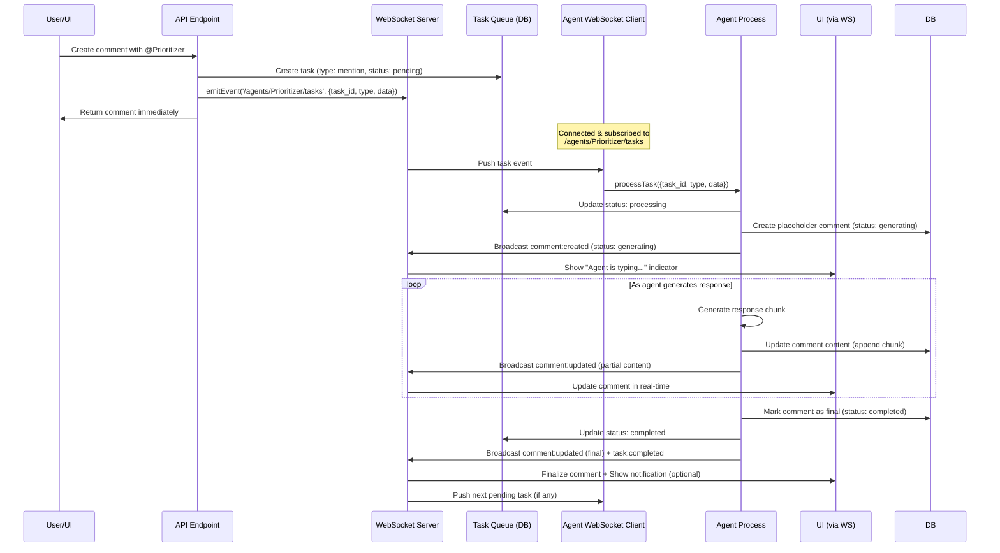

# ADR-028: Generic Agent Task Queue with WebSocket Push and Streaming Updates

---
**Metadata:**
- **ID**: ADR-028
- **Status**: Proposed
- **Date**: 2025-02-04
- **Updated**: 2025-02-04
- **Tags**: [architecture, ai, automation, nonlinear, websocket, real-time, streaming]
- **Impact Areas**: [nonlinear]
- **Decision Type**: architecture_pattern
- **Related Decisions**: [ADR-021, ADR-006, ADR-029]
- **Supersedes**: []
- **Superseded By**: []
---

## Context

Nonlinear's agent system (ADR-021) currently processes agent work (mentions, assignments, manual triggers) through synchronous API calls or polling. When a user mentions an agent in a comment, the API endpoint directly calls `triggerAgent()`, which processes the mention immediately within the API request handler. Agent services also poll for work at fixed intervals, causing delays and wasted CPU cycles.

**Current Limitations:**

1. **Synchronous Processing**: Agent processing happens synchronously in API requests, blocking responses until completion
2. **Tight Coupling**: API endpoints are tightly coupled to agent execution, making it difficult to scale or handle agent failures gracefully
3. **No Real-time Communication**: Agent services run independently but don't receive real-time notifications about work
4. **Hardcoded Behavior**: Agents always assume mentions are refinement requests, even when users are just asking questions
5. **Polling Inefficiency**: Agent services poll for work at fixed intervals (5 minutes for prioritizer, 10 seconds for developer/reviewer), causing delays and wasted CPU cycles
6. **No Visibility**: No way to see pending tasks or task status
7. **No Streaming**: Agent responses appear only when complete, no real-time feedback
8. **Single Task Limitation**: No mechanism to ensure agents process one task at a time

**Requirements:**

- Decouple agent processing from API requests
- Enable real-time agent responses with streaming updates
- Allow agents to decide their actions based on content (not hardcoded)
- Support multiple agent instances without conflicts
- Provide immediate visual feedback when agents are mentioned (streaming comments)
- Handle agent service failures gracefully
- Provide full observability of task status
- Ensure agents process one task at a time
- Design extensible system for future Pyrite chat integration

**Alternatives Considered:**

1. **Keep Synchronous API Triggering**: Continue calling `triggerAgent()` directly from API
   - ❌ Blocks API response until agent completes
   - ❌ Tight coupling between API and agents
   - ❌ No way to handle agent service being down
   - ❌ Difficult to scale or add retry logic

2. **Database Polling**: Agents poll database for unprocessed mentions
   - ✅ Decouples API from agent processing
   - ✅ Works even if agent service is temporarily down
   - ❌ Introduces latency (up to poll interval)
   - ❌ Wastes CPU cycles checking when nothing new
   - ❌ Not real-time

3. **WebSocket Push**: Agent services connect as WebSocket clients and receive push notifications
   - ✅ Real-time processing (immediate response)
   - ✅ Event-driven (no wasted CPU cycles)
   - ✅ Decouples API from agent processing
   - ✅ Uses existing WebSocket infrastructure
   - ✅ Auto-reconnects if connection drops
   - ✅ Scales well with multiple agent instances

4. **Message Queue (Redis/RabbitMQ)**: Use external message queue for agent notifications
   - ✅ Decoupled architecture
   - ✅ Reliable delivery guarantees
   - ❌ Adds external dependency
   - ❌ More complex setup and maintenance
   - ❌ Overkill for single-server deployment

## Decision

Implement **Generic Agent Task Queue with WebSocket Push and Streaming Updates**:

### 1. **Generic Task Queue System**

All agent work flows through a unified task queue system:

- **Task Types**: `mention`, `assignment`, `manual`, `refinement`
- **Task Status**: `pending`, `processing`, `completed`, `failed`
- **Single Task Processing**: Agents process one task at a time, queue others in memory
- **Database Persistence**: All tasks stored in `agent_tasks` table for offline resilience
- **Observability**: Full task lifecycle tracking with status updates

**Benefits:**
- Unified mechanism for all agent work
- Full visibility into pending/completed tasks
- Prevents duplicate processing
- Handles offline scenarios gracefully
- Extensible for future task types

### 2. **Agent Service WebSocket Client**

Agent services connect to the main Nonlinear service as WebSocket clients:

- **Connection**: Agent service connects to `/ws` endpoint using `WebSocketClient` from `@garage44/common/lib/ws-client`
- **Subscription**: Each agent subscribes to agent-specific topic: `/agents/:agentId/tasks`
- **Event Handling**: On receiving task event, agent processes immediately if not busy, otherwise queues
- **Database Catch-up**: On startup/reconnect, query database for pending tasks
- **No Polling**: Remove all polling mechanisms - agents are event-driven only

**Benefits:**
- Real-time processing (no delay)
- Efficient resource usage (only processes when needed)
- Automatic reconnection handling
- Works with existing WebSocket infrastructure
- Handles offline periods gracefully

### 3. **Streaming Comment Updates**

Agent responses update in real-time as content is generated:

- **Placeholder Creation**: Create comment immediately when task starts (status: `generating`)
- **Streaming Updates**: Update comment content as agent generates response (chunk by chunk)
- **Finalization**: Mark comment as `completed` when generation finishes
- **UI Feedback**: Show "Agent is thinking..." indicator during generation
- **Notification Strategy**: Only notify on completion (not during streaming) to avoid spam

**Benefits:**
- Immediate visual feedback
- Better user experience
- No notification spam
- Extensible for future chat integration

### 4. **Generic Streaming Infrastructure**

Design streaming system to be reusable for future Pyrite chat integration:

- **Generic Functions**: `createStreamingMessage()`, `updateStreamingMessage()`, `finalizeStreamingMessage()`
- **Type Support**: Works for `comment` (current) and `chat` (future)
- **Reusable UI Components**: Generic `StreamingMessage` component works for both
- **Consistent Events**: Same WebSocket events for comments and future chat

**Benefits:**
- Build once, reuse for chat
- Consistent user experience
- Less code to maintain
- Easy to extend

### 5. **API Endpoint Changes**

All agent triggers create tasks instead of calling `triggerAgent()` directly:

**Comment Creation** (`POST /api/tickets/:id/comments`):
- **Remove**: Direct `triggerAgent()` call
- **Add**: Create task via `createTask()` for each mentioned agent
- **Add**: WebSocket broadcast to `/agents/:agentId/tasks` topic
- **Keep**: Mention parsing and validation
- **Keep**: Comment storage in database

**Ticket Assignment** (`POST /api/tickets/:id/assign`):
- **Add**: Create `assignment` task when ticket assigned to agent
- **Add**: WebSocket broadcast

**Manual Trigger** (`POST /api/agents/:id/trigger`):
- **Change**: Create `manual` task instead of calling `triggerAgent()` directly
- **Add**: WebSocket broadcast

### 6. **Agent Decision-Making**

Replace hardcoded `refineTicketFromMention()` with intelligent `handleMention()` method:

- **LLM Analysis**: Agent analyzes comment content to determine user intent
- **Action Decision**: Agent decides appropriate action:
  - Question → Respond conversationally
  - Refinement request → Refine ticket description
  - Status check → Provide status update
  - Other requests → Handle contextually
- **Flexible Response**: Agent generates appropriate response and actions based on analysis
- **Streaming**: Stream response content as it's generated

**Benefits:**
- Agents adapt to user needs
- More natural conversation flow
- Reduces unnecessary ticket modifications
- Better user experience
- Real-time feedback

### 7. **Database Schema Enhancements**

**Task Queue Table:**
```sql
CREATE TABLE agent_tasks (
    id TEXT PRIMARY KEY,
    agent_id TEXT NOT NULL,
    task_type TEXT NOT NULL,        -- 'mention', 'assignment', 'manual', 'refinement'
    task_data TEXT NOT NULL,        -- JSON with task-specific data
    status TEXT NOT NULL,           -- 'pending', 'processing', 'completed', 'failed'
    priority INTEGER DEFAULT 0,     -- Higher = more urgent
    created_at INTEGER NOT NULL,
    started_at INTEGER,             -- When agent started processing
    completed_at INTEGER,           -- When task completed/failed
    error TEXT,                     -- Error message if failed
    FOREIGN KEY (agent_id) REFERENCES agents(id)
)
```

**Comments Table:**
- **Add**: `status` TEXT field (`generating`, `completed`, `failed`)
- **Add**: `responding_to` TEXT field (for threading)
- **Remove**: `agent_processed` field (replaced by task status)

**Indexes:**
- `idx_agent_tasks_agent_status` on `(agent_id, status)` - for finding pending tasks
- `idx_agent_tasks_created` on `(created_at)` - for ordering

### 8. **Implementation Flow**



## Consequences

### Positive

1. **Real-time Responses**: Agents respond immediately to all work types (no polling delay)
2. **Streaming Updates**: Users see agent responses update in real-time as they're generated
3. **Better User Experience**: Immediate visual feedback without notification spam
4. **Efficient Resource Usage**: Event-driven processing eliminates wasted CPU cycles
5. **Decoupled Architecture**: API and agents are independent, easier to scale and maintain
6. **Intelligent Agents**: Agents adapt to user intent rather than hardcoded behavior
7. **Scalability**: Multiple agent instances can subscribe without conflicts
8. **Resilience**: WebSocket client auto-reconnects, database catch-up handles offline periods
9. **Full Observability**: Complete visibility into task status and lifecycle
10. **Single Task Processing**: Agents process one task at a time, preventing conflicts
11. **Extensible Design**: Streaming infrastructure reusable for future Pyrite chat integration
12. **Unified System**: All agent work (mentions, assignments, manual) flows through same queue

### Negative

1. **Agent Service Dependency**: Agent service must be running to process tasks (but tasks are queued in database)
2. **WebSocket Connection Required**: Agent services need network access to main service
3. **Additional Complexity**: More moving parts than synchronous API call
4. **Database Overhead**: Task queue table adds storage requirements

### Neutral

1. **Database Still Used**: Comments and tasks stored in database for persistence and recovery
2. **Backward Compatible**: Existing comment structure maintained, just processing changes
3. **Future Chat Integration**: Streaming system designed to work with Pyrite chat when implemented

## Implementation Details

### Files to Create

1. **`packages/nonlinear/lib/agent/tasks.ts`**
   - Task queue management functions (`createTask()`, `getPendingTasks()`, `updateTaskStatus()`, etc.)

2. **`packages/nonlinear/lib/agent/streaming.ts`**
   - Generic streaming functions (`createStreamingMessage()`, `updateStreamingMessage()`, `finalizeStreamingMessage()`)
   - Works for comments (current) and future chat integration

3. **`packages/nonlinear/src/components/elements/streaming-message.tsx`**
   - Generic UI component for streaming messages (reusable for comments and chat)

### Files to Modify

1. **`packages/nonlinear/lib/database.ts`**
   - Create `agent_tasks` table with indexes
   - Add `status` and `responding_to` fields to `comments` table
   - Remove `agent_processed` field (replaced by task status)

2. **`packages/nonlinear/lib/agent/comments.ts`**
   - Add comment-specific wrappers using generic streaming functions
   - Add `createAgentCommentPlaceholder()`, `updateAgentComment()`, `finalizeAgentComment()`
   - Add WebSocket broadcasts for `comment:created`, `comment:updated`, `comment:completed`

3. **`packages/nonlinear/lib/agent/service.ts`**
   - Add WebSocket client connection to main service
   - Subscribe to `/agents/:agentId/tasks` topic
   - Remove polling mechanism (`setInterval`)
   - Implement single-task processing with in-memory queue
   - Add database catch-up on startup/reconnect
   - Handle task events and trigger agent processing

4. **`packages/nonlinear/lib/agent/scheduler.ts`**
   - Update `runAgent()` to handle task context
   - Mark tasks as processing/completed/failed
   - Check task status before processing

5. **`packages/nonlinear/lib/agent/prioritizer.ts`** (and similar for other agents)
   - Replace `refineTicketFromMention()` with `handleMention()`
   - Add LLM-based intent analysis
   - Implement flexible action decision logic
   - Use streaming comment functions for real-time updates

6. **`packages/nonlinear/api/tickets.ts`**
   - Remove `triggerAgent()` calls from comment creation endpoint
   - Create tasks via `createTask()` for each mentioned agent
   - Add WebSocket broadcast to `/agents/:agentId/tasks`
   - Create tasks when tickets assigned to agents

7. **`packages/nonlinear/api/agents.ts`**
   - Update manual trigger endpoint to create tasks instead of calling `triggerAgent()` directly

8. **`packages/nonlinear/src/components/pages/ticket-detail/ticket-detail.tsx`**
   - Handle `comment:created` with `generating` status (show typing indicator)
   - Handle `comment:updated` for streaming content updates
   - Handle `comment:completed` for finalization
   - Use generic `StreamingMessage` component

### Testing Considerations

- Test with agent service running vs not running
- Test WebSocket reconnection scenarios
- Test database catch-up on startup/reconnect
- Test multiple mentions in same comment
- Test different comment intents (question, refinement, status check)
- Test concurrent mentions to same agent
- Test single-task processing (agent queues tasks when busy)
- Test streaming comment updates (placeholder → streaming → final)
- Test task status updates (pending → processing → completed)
- Test multiple agent instances processing same task (should only process once)
- Test task priority ordering
- Test notification strategy (only on completion)
- Test UI streaming updates (typing indicator, real-time content)

## Future Extensions

### Pyrite Chat Integration

The streaming infrastructure is designed to be reusable for future Pyrite chat integration:

- **Same Functions**: Generic streaming functions work for chat messages
- **Same Components**: UI components reusable for chat
- **Same Events**: WebSocket events support multiple message types
- **Integration Point**: When implementing agent chat, use Pyrite's chat system (`packages/pyrite/api/ws-chat.ts`) and integrate with Nonlinear's streaming infrastructure

**Future Implementation:**
- Agents can participate in Pyrite chat channels
- Agent chat messages use same streaming pattern as comments
- Reuse `StreamingMessage` component for chat UI
- Same task queue system can handle chat-based tasks

## References

- ADR-021: Nonlinear - AI-Powered Automated Project Management
- ADR-006: WebSocket Migration
- ADR-029: WebSocket Robustness Improvements and Protocol Documentation
- `packages/common/lib/ws-client.ts` - WebSocket client implementation
- `packages/common/lib/ws-server.ts` - WebSocket server implementation
- `packages/pyrite/api/ws-chat.ts` - Pyrite chat WebSocket API (for future integration)