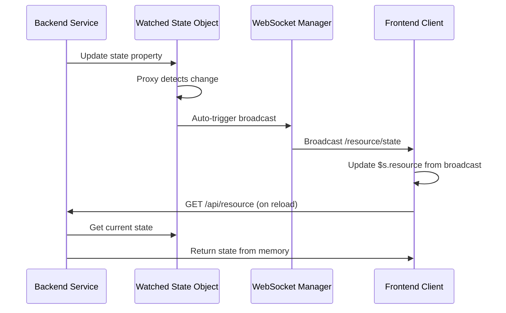

# ADR-031: Watched State Pattern for Real-time Synchronization

---
**Metadata:**
- **ID**: ADR-031
- **Status**: Proposed
- **Date**: 2025-02-05
- **Tags**: [architecture, pattern, state-management, websocket, real-time, expressio]
- **Impact Areas**: [nonlinear, expressio]
- **Decision Type**: architecture_pattern
- **Related Decisions**: [ADR-004, ADR-006, ADR-030]
- **Supersedes**: []
- **Superseded By**: []
---

## Context

Real-time state synchronization between backend services and frontend clients requires efficient mechanisms to:
- Keep frontend state in sync with backend state
- Minimize manual subscription management
- Automatically propagate state changes to all clients
- Handle state initialization on frontend reload
- Support extensible state properties

**Current Approaches:**

1. **Manual Subscriptions**: Frontend subscribes to individual events (`agent:service-online`, `agent:service-offline`, etc.)
   - ❌ Requires multiple subscriptions
   - ❌ Easy to miss events
   - ❌ Complex to maintain

2. **Polling**: Frontend periodically requests state from backend
   - ❌ Inefficient (unnecessary requests)
   - ❌ Delayed updates
   - ❌ Doesn't scale well

3. **On-Demand Computation**: Backend computes state on each request
   - ❌ Expensive operations repeated unnecessarily
   - ❌ State can be inconsistent between requests
   - ❌ Doesn't persist across frontend reloads

**Expressio's Solution:**

Expressio implements a **watched state pattern** where:
- Backend maintains state in memory with Proxy-based change detection
- State changes automatically trigger broadcasts
- Frontend has a single listener that updates global state
- No manual subscriptions needed

## Decision

Adopt the **Watched State Pattern** for real-time state synchronization:

### Pattern Overview



### Implementation Components

#### 1. **Watched State Object (Backend)**

Create a state object wrapped in a Proxy that watches for changes:

```typescript
class ResourceState {
  private _state: ResourceStateData = {}
  private wsManager?: WebSocketServerManager

  // Create proxy that watches for changes
  private createDeepProxy<T>(obj: T, onChange: () => void): T {
    return new Proxy(obj, {
      set: (target, prop, value) => {
        const oldValue = target[prop]
        target[prop] = value

        if (oldValue !== value) {
          this.trackOperation(onChange)
        }
        return true
      },
      // ... handle get, deleteProperty for deep watching
    })
  }

  // Initialize with proxy
  constructor(wsManager: WebSocketServerManager) {
    this.wsManager = wsManager
    this._state = this.createDeepProxy(this._state, () => {
      this.broadcastState()
    })
  }

  // Broadcast state to all clients
  broadcastState(): void {
    if (this.wsManager) {
      this.wsManager.broadcast('/resource/state', {
        state: this._state,
        timestamp: Date.now(),
      })
  }
}
```

#### 2. **State Update Mechanism**

State updates automatically trigger broadcasts:

```typescript
// Update state - proxy automatically triggers broadcast
resourceState.state.serviceOnline = true
// → Proxy detects change
// → Calls broadcastState()
// → Broadcasts to /resource/state
```

#### 3. **Frontend State Listener**

Single listener updates global state:

```typescript
// Single listener for all state updates
ws.on('/resource/state', ({state, timestamp}) => {
  // Update global state directly
  $s.resource = state
  $s.resource.lastStateUpdateTime = timestamp
})
```

#### 4. **Initial State Load**

On frontend load/reload, fetch current state:

```typescript
// Initial load
const result = await ws.get('/api/resource')
$s.resource = result.resource

// After that, updates come automatically via broadcasts
```

### Key Characteristics

1. **Automatic Broadcasting**: State changes automatically trigger broadcasts (no manual calls)
2. **Single Source of Truth**: State maintained in one place on backend
3. **Global Frontend State**: Single listener updates `$s.resource` automatically
4. **No Manual Subscriptions**: No need to subscribe to individual events
5. **Extensible**: Easy to add new state properties
6. **Performance**: State stored in memory, no expensive recomputation

### Expressio Example

Expressio uses this pattern for `workspace.i18n`:

**Backend** (`packages/expressio/lib/workspace.ts`):
- `_i18n` wrapped in Proxy via `createDeepProxy()`
- Changes trigger `broadcastI18nState()`
- Broadcasts to `/i18n/state`

**Frontend** (`packages/expressio/src/components/pages/workspace/translations/translations.tsx`):
- Single listener: `ws.on('/i18n/state', ({i18n}) => { $s.workspace.i18n = i18n })`
- Updates global state automatically

## Consequences

**Benefits:**
- **Automatic**: State changes automatically trigger broadcasts
- **Simple**: Single listener, no complex subscription logic
- **Consistent**: State always matches backend reality
- **Performant**: No expensive recomputation on each request
- **Extensible**: Easy to add new state properties
- **Reliable**: State persists across frontend reloads

**Trade-offs:**
- Requires Proxy support (available in modern JavaScript)
- State must be serializable (for WebSocket transmission)
- Broadcasts all state changes (can be throttled if needed)

**When to Use:**
- State that changes frequently and needs real-time sync
- Multiple clients need the same state
- State properties are related and should be updated together
- Frontend needs to stay in sync with backend state

**When NOT to Use:**
- One-time events (use direct broadcasts instead)
- State that rarely changes (polling may be sufficient)
- Very large state objects (consider incremental updates)
- State that's client-specific (use individual subscriptions)

## Implementation Notes

### Backend Pattern

1. Create state class with Proxy-wrapped state object
2. Proxy watches for property changes
3. Changes trigger `broadcastState()` method
4. Broadcast includes full state + timestamp
5. State initialized from database/config on startup

### Frontend Pattern

1. Single WebSocket listener on `/resource/state`
2. Listener updates global DeepSignal state (`$s.resource`)
3. Initial load fetches state via GET request
4. Subsequent updates come via broadcasts
5. Use timestamp to prevent race conditions

### Throttling (Optional)

For frequently changing state, use throttled broadcasts:

```typescript
private lastBroadcastTime = 0
private readonly BROADCAST_THROTTLE_TIME = 2000

throttledBroadcastState(): void {
  const now = Date.now()
  if (now - this.lastBroadcastTime < this.BROADCAST_THROTTLE_TIME) {
    return
  }
  this.lastBroadcastTime = now
  this.broadcastState()
}
```

## Examples

### Expressio: i18n State
- Watches `workspace.i18n` object
- Auto-broadcasts `/i18n/state` on changes
- Frontend updates `$s.workspace.i18n`

### Nonlinear: Agent State (Planned)
- Watch agent state (serviceOnline, lastHeartbeat, etc.)
- Auto-broadcast `/agents/state` on changes
- Frontend updates `$s.agents`

### Potential Uses
- Workspace settings state
- User presence state
- System configuration state
- Real-time metrics/statistics

## References

- Expressio implementation: `packages/expressio/lib/workspace.ts`
- Expressio frontend: `packages/expressio/src/components/pages/workspace/translations/translations.tsx`
- WebSocket broadcasting: `packages/common/lib/ws-server.ts`
