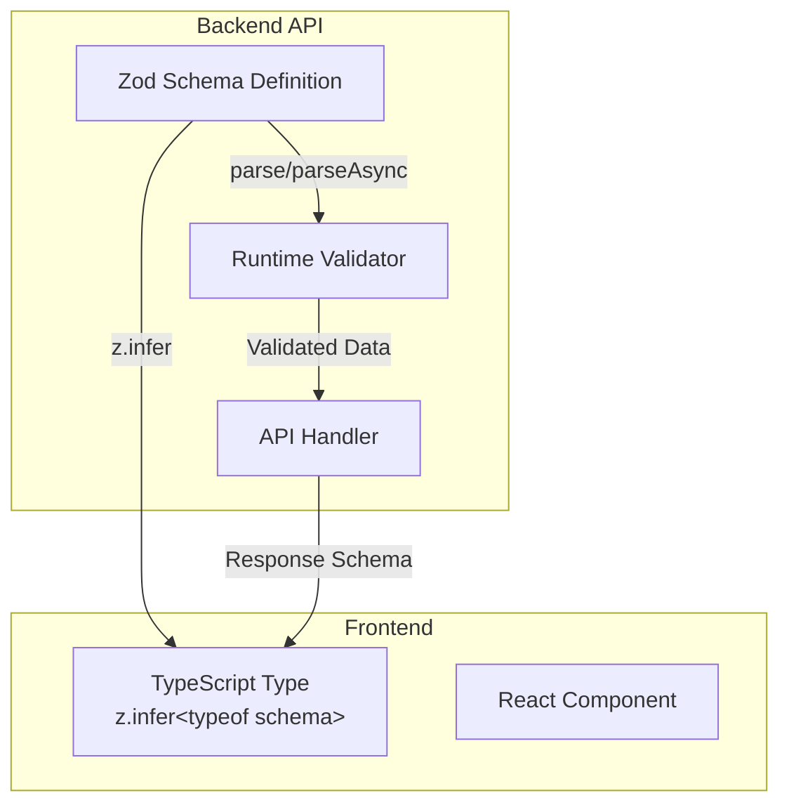

# ADR-032: Zod-Based API Typing and Validation for Nonlinear

---
**Metadata:**
- **ID**: ADR-032
- **Status**: Accepted
- **Date**: 2026-02-04
- **Tags**: [architecture, typing, validation, api, zod, typescript, nonlinear]
- **Impact Areas**: [nonlinear]
- **Decision Type**: architecture_pattern
- **Related Decisions**: [ADR-004, ADR-006, ADR-029]
- **Supersedes**: []
- **Superseded By**: []
---

## Context

The nonlinear package currently uses manual type assertions (`as {...}`) throughout API endpoints with no runtime validation. This leads to:

- **Type Safety Issues**: Types can drift from runtime behavior
- **No Runtime Validation**: Invalid data can reach handlers
- **Code Duplication**: Types are duplicated between endpoints and frontend
- **Maintenance Burden**: Changes require updating multiple type definitions
- **No Schema Reuse**: Cannot share schemas between backend validation and frontend types

**Current State:**
- WebSocket API routes in `packages/nonlinear/api/*.ts` (agents, tickets, repositories, labels, docs, ci, deploy)
- HTTP API routes (some endpoints have both WebSocket and HTTP versions)
- Request/response types use inline type assertions: `req.data as {...}`
- Database query results manually typed: `db.prepare(...).all() as Array<{...}>`
- Frontend types in `packages/nonlinear/src/types.ts` manually maintained
- No runtime validation - invalid data can reach handlers

**Example of Current Pattern:**
```typescript
wsManager.api.post('/api/tickets', async(_ctx, req) => {
  const {
    repository_id,
    title,
    status = 'backlog',
  } = req.data as {
    repository_id: string
    title: string
    status?: 'backlog' | 'todo' | 'in_progress' | 'review' | 'closed'
  }

  if (!repository_id || !title) {
    throw new Error('repository_id and title are required')
  }
  // ... handler logic
})
```

## Decision

Adopt **Zod** for all API endpoint validation and typing with the following principles:

1. **Schema-First**: Define Zod schemas for all API request/response types
2. **Inference Over Interfaces**: Use `z.infer<typeof schema>` instead of manual interfaces where possible
3. **Runtime Validation**: Validate all request data at API boundaries
4. **Shared Schemas**: Export schemas for frontend type inference
5. **Minimal Manual Types**: Only define interfaces when absolutely necessary (e.g., complex computed types)

### Architecture



### Implementation

#### Schema Organization

Schemas are organized by domain in `packages/nonlinear/lib/schemas/`:

- `common.ts` - Shared schemas (IdSchema, TimestampSchema, PaginationQuerySchema)
- `agents.ts` - Agent-related schemas
- `tickets.ts` - Ticket schemas (including comments)
- `repositories.ts` - Repository schemas
- `labels.ts` - Label schemas
- `docs.ts` - Documentation schemas
- `ci.ts` - CI schemas
- `deploy.ts` - Deployment schemas
- `index.ts` - Central export point for frontend types

#### Validation Helper

Created `packages/nonlinear/lib/api/validate.ts`:

```typescript
export function validateRequest<T extends z.ZodType>(
    schema: T,
    data: unknown,
): z.infer<T> {
    return schema.parse(data)
}
```

#### Schema Design Patterns

**Pattern 1: Request/Response Pairs**
```typescript
export const CreateTicketRequestSchema = z.object({
  repository_id: IdSchema,
  title: z.string().min(1),
  description: z.string().optional(),
  status: TicketStatusSchema.default('backlog'),
  // ... other fields
})

export const EnrichedTicketSchema = TicketDbSchema.extend({
  assignees: z.array(TicketAssigneeSchema),
  labels: z.array(z.string()),
  repository_name: z.string().nullable(),
})

export type CreateTicketRequest = z.infer<typeof CreateTicketRequestSchema>
export type EnrichedTicket = z.infer<typeof EnrichedTicketSchema>
```

**Pattern 2: Enriched Responses**
```typescript
// Base schema from database
const TicketDbSchema = z.object({
  id: IdSchema,
  title: z.string(),
  // ... database fields
})

// Enriched response with computed fields
export const EnrichedTicketSchema = TicketDbSchema.extend({
  assignees: z.array(TicketAssigneeSchema),
  labels: z.array(z.string()),
  repository_name: z.string().nullable(),
})
```

**Pattern 3: ID Schema**
```typescript
// IDs are generated with randomId() - short alphanumeric strings, not UUIDs
export const IdSchema = z.string().min(1)

// Use UuidSchema only when actual UUID validation is needed
export const UuidSchema = z.string().uuid()
```

#### Migration Example

**Before:**
```typescript
wsManager.api.post('/api/tickets', async(_ctx, req) => {
  const {
    repository_id,
    title,
    status = 'backlog',
  } = req.data as {
    repository_id: string
    title: string
    status?: 'backlog' | 'todo' | 'in_progress' | 'review' | 'closed'
  }

  if (!repository_id || !title) {
    throw new Error('repository_id and title are required')
  }
  // ... handler logic
})
```

**After:**
```typescript
import {CreateTicketRequestSchema} from '../lib/schemas/tickets.ts'
import {validateRequest} from '../lib/api/validate.ts'

wsManager.api.post('/api/tickets', async(_ctx, req) => {
  const data = validateRequest(CreateTicketRequestSchema, req.data)
  // data is now typed and validated
  // ... handler logic
})
```

#### Frontend Integration

**Before:**
```typescript
export interface NonlinearState extends CommonState {
  tickets: Array<{
    id: string
    title: string
    status: 'backlog' | 'todo' | 'in_progress' | 'review' | 'closed'
    // ... manually maintained
  }>
}
```

**After:**
```typescript
import type {EnrichedTicket, EnrichedAgent, Repository, EnrichedDoc} from '../lib/schemas/index.ts'

export interface NonlinearState extends CommonState {
  agents: Array<EnrichedAgent>
  tickets: Array<EnrichedTicket>
  repositories: Array<Repository>
  docs: Array<EnrichedDoc>
}
```

## Consequences

### Benefits

1. **Type Safety**: Types automatically match runtime validation - no drift
2. **Runtime Validation**: Invalid data caught at API boundaries with detailed error messages
3. **Single Source of Truth**: Schemas define both validation and types
4. **Better Error Messages**: Zod provides detailed validation errors with paths
5. **Reduced Code**: No need for manual type definitions - inference handles it
6. **Frontend/Backend Sync**: Shared schemas ensure consistency between frontend and backend
7. **Developer Experience**: Better IDE autocomplete and type checking

### Trade-offs

1. **Initial Migration Effort**: Required updating all API endpoints (completed)
2. **Schema Maintenance**: Schemas must be kept in sync with database schema
3. **Learning Curve**: Team needs to learn Zod patterns (minimal - straightforward API)
4. **Bundle Size**: Zod adds ~14KB (gzipped) to bundle (acceptable trade-off)
5. **ID Format Discovery**: Initially used UUID validation but IDs are actually short alphanumeric strings - fixed by using `IdSchema = z.string().min(1)`

### Implementation Status

✅ **Completed:**
- All API endpoints migrated to use Zod schemas
- All request/response types inferred from schemas
- Frontend types use exported schema types
- Runtime validation catches invalid requests
- No manual type assertions (`as {...}`) in API handlers
- All TypeScript errors fixed

**Migration Order (Completed):**
1. Labels API (`api/labels.ts`) - Simplest, fewest endpoints
2. Repositories API (`api/repositories.ts`) - Moderate complexity
3. Tickets API (`api/tickets.ts`) - Complex but well-defined
4. Agents API (`api/agents.ts`) - Complex with many endpoints
5. Docs API (`api/docs.ts`) - Moderate complexity
6. CI API (`api/ci.ts`) - Moderate complexity
7. Deploy API (`api/deploy.ts`) - Complex with external integrations

### Lessons Learned

1. **ID Format**: Initially assumed UUIDs, but `randomId()` generates short alphanumeric strings. Fixed by creating `IdSchema = z.string().min(1)` and separate `UuidSchema` for actual UUID validation.

2. **Database Query Results**: Database queries return untyped results - schemas validate these results before use, ensuring type safety.

3. **Enriched Responses**: Use `.extend()` to add computed fields (like assignees, labels) to base database schemas.

4. **Validation Errors**: Zod errors are automatically caught and returned as WebSocket error responses, providing detailed feedback to clients.

## Related Decisions

- **ADR-004**: Preact + WebSocket Architecture (API structure)
- **ADR-006**: REST to WebSocket Migration (API patterns)
- **ADR-029**: WebSocket Robustness (error handling)

## Future Considerations

- **OpenAPI Generation**: Could generate OpenAPI specs from Zod schemas for API documentation
- **Client Generation**: Could generate TypeScript clients from schemas for external consumers
- **Form Validation**: Could reuse schemas for frontend form validation (currently using custom validation)
- **Database Migrations**: Could validate database schemas match Zod schemas to prevent drift
- **Schema Versioning**: Consider versioning schemas for API evolution

## References

- [Zod Documentation](https://zod.dev/)
- Implementation: `packages/nonlinear/lib/schemas/`
- Validation Helper: `packages/nonlinear/lib/api/validate.ts`
- Frontend Types: `packages/nonlinear/src/types.ts`
