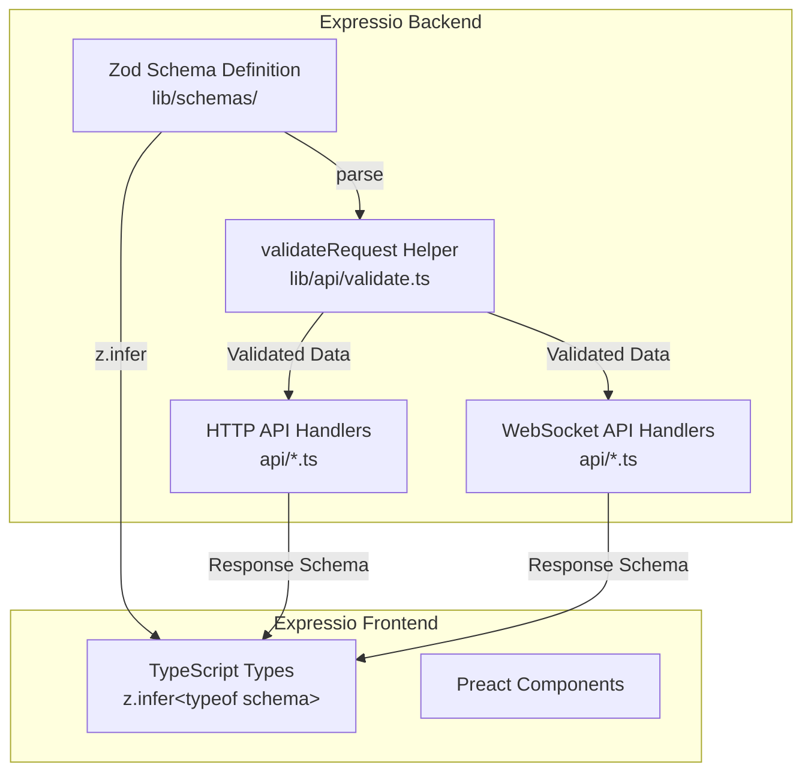

# ADR-033: Zod-Based API Typing and Validation for Expressio

---
**Metadata:**
- **ID**: ADR-033
- **Status**: Proposed
- **Date**: 2026-02-05
- **Tags**: [architecture, typing, validation, api, zod, typescript, expressio]
- **Impact Areas**: [expressio]
- **Decision Type**: architecture_pattern
- **Related Decisions**: [ADR-032, ADR-004, ADR-006, ADR-029]
- **Supersedes**: []
- **Superseded By**: []
---

## Decision

Adopt **Zod** for all Expressio API endpoint validation and typing, following the proven pattern established in Nonlinear (ADR-032). This will add runtime validation and type safety to all HTTP and WebSocket API endpoints in Expressio.

**Approach**: Schema-first validation with Zod, using `z.infer<typeof schema>` for type inference, validating all request data at API boundaries.

**Key Constraints**: 
- Must maintain backward compatibility with existing API contracts
- Must work with both HTTP and WebSocket APIs
- Must follow established patterns from ADR-032

## Context

**Problem**: Expressio currently uses manual type assertions (`as {...}`) throughout API endpoints with no runtime validation. This leads to:

- **Type Safety Issues**: Types can drift from runtime behavior
- **No Runtime Validation**: Invalid data can reach handlers
- **Code Duplication**: Types are duplicated between endpoints and frontend
- **Maintenance Burden**: Changes require updating multiple type definitions
- **No Schema Reuse**: Cannot share schemas between backend validation and frontend types

**Current State:**
- HTTP API routes in `packages/expressio/api/*.ts` (config.ts, users.ts, workspaces.ts, i18n.ts)
- WebSocket API routes registered via `registerI18nWebSocketApiRoutes()` and `registerWorkspacesWebSocketApiRoutes()`
- Request/response types use inline type assertions: `req.data as {...}`, `await req.json() as {...}`
- Frontend types in `packages/expressio/src/types.ts` manually maintained
- No runtime validation - invalid data can reach handlers

**Example of Current Pattern:**
```typescript
// WebSocket API
apiWs.post('/api/workspaces/:workspace_id/paths', async(_context, request) => {
    const {path, value} = request.data as {path: string[]; value: unknown}
    // ... handler logic
})

// HTTP API
router.post('/api/config', async(req) => {
    const body = await req.json() as {
        enola: {engines: Record<string, {api_key?: string; base_url?: string}>}
        language_ui: string
        workspaces: Array<{source_file?: string; workspace_id: string}>
    }
    // ... handler logic
})
```

## Rationale

**Primary Reasoning**:

1. **Proven Pattern**: ADR-032 successfully implemented Zod validation in Nonlinear with measurable benefits
2. **Type Safety**: Types automatically match runtime validation - eliminates type drift
3. **Runtime Validation**: Invalid data caught at API boundaries with detailed error messages
4. **Single Source of Truth**: Schemas define both validation and types, reducing duplication
5. **Consistency**: Aligns Expressio with established patterns in Nonlinear package
6. **Developer Experience**: Better IDE autocomplete and type checking

**Alternatives Considered**:

| Alternative | Pros | Cons | Rejected Because |
|------------|------|------|------------------|
| Manual validation | No new dependency | Error-prone, duplicated code | Already causing issues |
| Type-only solution (TypeScript) | No runtime overhead | No runtime validation | Need runtime safety |
| Yup/Joi | Similar features | Less TypeScript integration | Zod has better TS inference |
| Keep current approach | No migration effort | Type drift, no validation | Problematic current state |

**Trade-offs**:
- **Accepted**: Initial migration effort → **Gained**: Long-term maintainability and type safety
- **Accepted**: Schema maintenance overhead → **Gained**: Single source of truth for types
- **Mitigation**: Follow proven migration order from ADR-032 (simplest to most complex)

## Implementation

### Architecture



### Schema Organization

Schemas are organized by domain in `packages/expressio/lib/schemas/`:

- `common.ts` - Shared schemas (IdSchema, PathSchema, LanguageIdSchema)
- `i18n.ts` - i18n/translation schemas (paths, tags, translate)
- `workspaces.ts` - Workspace schemas (browse, create, update, delete)
- `config.ts` - Config schemas (get/update config)
- `users.ts` - User schemas (avatar upload)
- `index.ts` - Central export point for frontend types

### Validation Helper

Create `packages/expressio/lib/api/validate.ts`:

```typescript
import {z} from 'zod'

/**
 * Validate request data against a Zod schema
 * Throws ZodError if validation fails
 */
export function validateRequest<T extends z.ZodType>(
    schema: T,
    data: unknown,
): z.infer<T> {
    return schema.parse(data)
}
```

### Schema Design Patterns

**Pattern 1: Request/Response Pairs**
```typescript
export const CreatePathRequestSchema = z.object({
    path: z.array(z.string()),
    value: z.object({
        cache: z.string().optional(),
        source: z.string(),
        target: z.record(z.string()),
    }),
})

export type CreatePathRequest = z.infer<typeof CreatePathRequestSchema>
```

**Pattern 2: Path Parameters**
```typescript
// WebSocket params (from request.params)
export const WorkspaceIdParamsSchema = z.object({
    workspace_id: z.string().min(1),
})

// HTTP params (from params.param0, params.param1, etc.)
export const WorkspaceIdPathSchema = z.object({
    param0: z.string().min(1), // workspace_id
})
```

**Pattern 3: ID Schema**
```typescript
// IDs are strings (workspace IDs, user IDs)
export const IdSchema = z.string().min(1)

// Translation paths are string arrays
export const PathSchema = z.array(z.string())
```

### Migration Example

**Before:**
```typescript
apiWs.post('/api/workspaces/:workspace_id/paths', async(_context, request) => {
    const {workspace_id} = request.params
    const {path, value} = request.data as {path: string[]; value: unknown}
    // ... handler logic
})
```

**After:**
```typescript
import {CreatePathRequestSchema} from '../lib/schemas/i18n.ts'
import {validateRequest} from '../lib/api/validate.ts'

apiWs.post('/api/workspaces/:workspace_id/paths', async(_context, request) => {
    const {workspace_id} = validateRequest(WorkspaceIdParamsSchema, request.params)
    const data = validateRequest(CreatePathRequestSchema, request.data)
    // data is now typed and validated
    // ... handler logic
})
```

### Error Handling

**WebSocket Errors**: Automatically handled by `WebSocketServerManager` - Zod errors thrown from handlers are caught and sent as error responses (see `packages/common/lib/ws-server.ts:440-450`).

**HTTP Errors**: Add try-catch blocks to return proper HTTP error responses:
```typescript
try {
    const data = validateRequest(Schema, await req.json())
    // ... handler logic
} catch (error) {
    if (error instanceof z.ZodError) {
        return new Response(JSON.stringify({error: error.errors}), {
            status: 400,
            headers: {'Content-Type': 'application/json'},
        })
    }
    throw error
}
```

### Frontend Integration

**Before:**
```typescript
interface ExpressioStateBase {
    workspace: Workspace
    // ... manually maintained types
}
```

**After:**
```typescript
import type {
    WorkspaceResponse,
    TranslationResponse,
    // ... other schema types
} from '../lib/schemas/index.ts'

interface ExpressioStateBase {
    workspace: WorkspaceResponse
    // ... types inferred from schemas
}
```

## Consequences

### Benefits

1. **Type Safety**: Types automatically match runtime validation - no drift
2. **Runtime Validation**: Invalid data caught at API boundaries with detailed error messages
3. **Single Source of Truth**: Schemas define both validation and types
4. **Better Error Messages**: Zod provides detailed validation errors with paths
5. **Reduced Code**: No need for manual type definitions - inference handles it
6. **Frontend/Backend Sync**: Shared schemas ensure consistency between frontend and backend
7. **Developer Experience**: Better IDE autocomplete and type checking
8. **Consistency**: Aligns Expressio with Nonlinear's proven patterns

### Trade-offs

1. **Initial Migration Effort**: Required updating all API endpoints (~6 API files)
2. **Schema Maintenance**: Schemas must be kept in sync with API contracts
3. **Learning Curve**: Team needs to learn Zod patterns (minimal - straightforward API, already used in Nonlinear)
4. **Bundle Size**: Zod adds ~14KB (gzipped) to bundle (acceptable trade-off)
5. **Dependency**: Adds Zod as a dependency (already in catalog, used in Nonlinear)

### Implementation Status

⏳ **Proposed** - Not yet implemented

**Planned Migration Order** (following ADR-032 pattern):
1. Config API (`api/config.ts`) - Simplest, fewest endpoints
2. Users API (`api/users.ts`) - Single endpoint (avatar upload)
3. i18n HTTP API (`api/i18n.ts`) - Single GET endpoint
4. Workspaces HTTP API (`api/workspaces.ts`) - Moderate complexity
5. i18n WebSocket API (`api/i18n.ts`) - Complex with many endpoints
6. Workspaces WebSocket API (`api/workspaces.ts`) - Moderate complexity

## Architecture Impact

**Principles Affected**:
- **Real-time First** (ADR-004): Reinforced - WebSocket APIs get same validation as HTTP
- **Package Boundary Discipline** (ADR-001): No change - schemas stay within Expressio package
- **Developer Experience Priority** (ADR-003): Enhanced - better type safety and validation

**System-Wide Changes**:
- **Packages**: Expressio only - no impact on other packages
- **Communication**: No change to API contracts - validation is transparent to clients
- **Dependencies**: Adds Zod dependency (already in catalog)

**Future Constraints**:
- New API endpoints must use Zod schemas
- Schema changes require updating both validation and types (single source of truth)
- Frontend types should use exported schema types for consistency

## Decision Pattern

**When to Apply**:
- Adding new API endpoints in Expressio
- Migrating existing endpoints from manual type assertions
- Need runtime validation for API boundaries
- Want type safety that matches runtime behavior

**When NOT to Apply**:
- Internal function parameters (use TypeScript types only)
- Database schemas (separate concern)
- Frontend-only types (use TypeScript interfaces)

**Criteria** (weighted):
- Type Safety: 10/10
- Runtime Validation: 10/10
- Developer Experience: 9/10
- Consistency with Existing Patterns: 10/10
- Migration Effort: 6/10 (acceptable one-time cost)

**Success Metrics**:
- Zero manual type assertions (`as {...}`) in API handlers
- All API endpoints have runtime validation
- Frontend types use exported schema types
- No breaking changes to API contracts

## AI Prompts

**When Evaluating Similar Decisions**:
1. "Does this API endpoint need runtime validation?"
2. "Can we reuse schemas from Nonlinear or Expressio?"
3. "Should this follow the Zod validation pattern?"

**Pattern Recognition**:
- If adding API endpoints, use Zod schemas
- If migrating from manual assertions, follow ADR-032/ADR-033 pattern
- If need type safety + validation, Zod is the solution

**Red Flags**:
- ⚠️ Manual type assertions in API handlers: Indicates missing Zod validation
- ⚠️ Duplicate type definitions: Should use schema inference instead
- ⚠️ No runtime validation: Types may drift from reality

**Consistency Checks**:
- Aligns with ADR-032: Same pattern, different package
- Aligns with ADR-004: WebSocket APIs get same validation treatment
- Aligns with ADR-006: Both HTTP and WebSocket use same validation approach

## Related Decisions

- **ADR-032**: Zod-Based API Typing and Validation for Nonlinear (proven pattern)
- **ADR-004**: Preact + WebSocket Architecture (API structure)
- **ADR-006**: REST to WebSocket Migration (API patterns)
- **ADR-029**: WebSocket Robustness (error handling)

## Future Considerations

- **OpenAPI Generation**: Could generate OpenAPI specs from Zod schemas for API documentation
- **Client Generation**: Could generate TypeScript clients from schemas for external consumers
- **Form Validation**: Could reuse schemas for frontend form validation
- **Pyrite Migration**: Apply same pattern to Pyrite package after Expressio migration
- **Schema Versioning**: Consider versioning schemas for API evolution

## References

- [Zod Documentation](https://zod.dev/)
- **ADR-032**: Zod-Based API Typing and Validation for Nonlinear
- **Nonlinear Implementation**: `packages/nonlinear/lib/schemas/` and `packages/nonlinear/lib/api/validate.ts`
- **WebSocket Error Handling**: `packages/common/lib/ws-server.ts:440-450`
- **Expressio API Structure**: `packages/expressio/api/*.ts`
