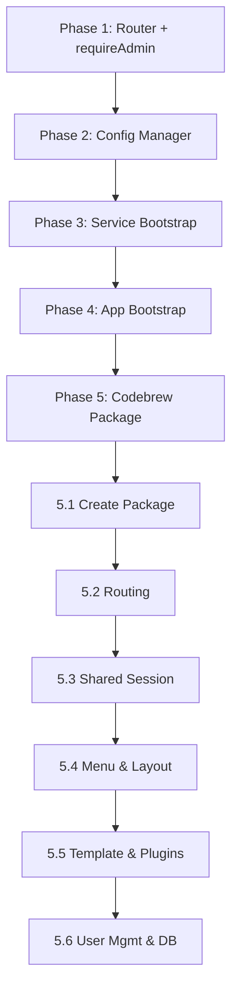

# ADR-034: Codebrew Package Reuse Optimization

---
**Metadata:**
- **ID**: ADR-034
- **Status**: Proposed
- **Date**: 2026-02-12
- **Tags**: [architecture, package-reuse, codebrew, expressio, pyrite, nonlinear, monorepo]
- **Impact Areas**: [expressio, pyrite, nonlinear, common]
- **Decision Type**: architecture_pattern
- **Related Decisions**: [ADR-001, ADR-004, ADR-007, ADR-012, ADR-015, ADR-016, ADR-021, ADR-024]
- **Supersedes**: []
- **Superseded By**: []
---

## Decision

Adopt a **package reuse optimization strategy** to enable creating **Codebrew**—a unified application that cohesively integrates Pyrite, Nonlinear, and Expressio with minimal boilerplate. This involves extracting duplicated infrastructure code to `@garage44/common`, creating service/app bootstrap factories, and establishing composition patterns for the unified Codebrew package.

**Approach**: Incremental extraction of duplicated patterns, creation of `createServiceBootstrap()` and `createAppBootstrap()` factories, and phased implementation of the Codebrew package.

**Key Constraints**:
- Must maintain backward compatibility—existing packages continue to work standalone
- Must respect ADR-001 package boundaries (domain separation)
- Must not introduce circular dependencies
- Must align with ADR-015 unified authentication when implemented

## Context

**Problem**: The workspace has three application packages (Expressio, Pyrite, Nonlinear) that share substantial infrastructure but implement it independently. Creating a unified "Codebrew" application that combines all three would require significant boilerplate duplication. Current state shows:

- **~150 lines of near-identical Router class** duplicated across 3 middleware files
- **Identical requireAdmin middleware** in 3 packages
- **~80% similar service.ts bootstrap** across packages (yargs, Bun.serve, WebSocket setup)
- **~90% similar app.ts entry point** in Expressio and Pyrite
- **Config init/save patterns** with same structure but different defaults
- **No shared session**—each app has separate cookie (expressio-session, pyrite-session, nonlinear-session)

**Current Package Dependencies**:
```
expressio → common, bunchy
pyrite → common, bunchy, expressio (for i18n only)
nonlinear → common, bunchy
```

**Requirements**:
- Single Codebrew application serving Pyrite + Nonlinear + Expressio
- Minimal boilerplate for new integrated features
- Shared authentication across sub-apps (single sign-on)
- Independent deployability of packages (standalone mode preserved)
- Clear composition boundaries for sub-application routing

**Current State**:
- Each package runs as separate process (different ports: 3030, 3031, 3032)
- Deploy config uses separate systemd services and nginx locations
- Pyrite embeds Expressio i18n via `.expressio.json` (naming confusion)
- Common package provides: middleware, database, WebSocket, auth, App class, components

## Analysis: Duplication Inventory

### 1. Router Class (High Duplication)

**Location**: `expressio/lib/middleware.ts`, `pyrite/lib/middleware.ts`, `nonlinear/lib/middleware.ts`

**Duplication**: ~50 lines each, 99% identical. Only difference: Expressio's Router is not exported; Pyrite exports with Session type; Nonlinear uses `unknown` for session.

**Extraction Target**: `@garage44/common/lib/router.ts`

```typescript
// Proposed common/lib/router.ts
export class Router {
    routes: Array<{...}> = []
    get(path, handler) { this.add('GET', path, handler) }
    post(path, handler) { this.add('POST', path, handler) }
    put(path, handler) { this.add('PUT', path, handler) }
    delete(path, handler) { this.add('DELETE', path, handler) }
    private add(method, path, handler) { /* regex path params */ }
    async route(req, session?): Promise<Response | null> { /* matching logic */ }
}
```

### 2. requireAdmin Middleware (High Duplication)

**Location**: Same 3 middleware files

**Duplication**: Identical 8-line implementation in each package

**Extraction Target**: `@garage44/common/lib/middleware.ts` (add `requireAdmin` export)

### 3. Service Bootstrap Pattern (Medium-High Duplication)

**Location**: `expressio/service.ts`, `pyrite/service.ts`, `nonlinear/service.ts`

**Common Pattern** (all packages):
1. createRuntime, createWelcomeBanner, setupBunchyConfig, loggerTransports
2. yargs CLI with scriptName
3. Bunchy setup (dev only)
4. `start` command: initConfig → initDatabase → service.init → initMiddleware → createWebSocketManagers → Bun.serve
5. WebSocket handler with /ws and /bunchy endpoints
6. devContext snapshot for /dev/snapshot

**Variations**:
- Expressio: Many CLI commands (init, import, translate-all, stats, export, lint)
- Pyrite: config.sfu for Galène proxy, initializeDefaultData
- Nonlinear: Many CLI commands (deploy-pr, agent, indexing), bootstrap state injection, sessionMiddleware return

**Extraction Target**: `@garage44/common/lib/service-bootstrap.ts`

```typescript
// Proposed factory
export async function createServiceBootstrap(options: {
    appName: string
    packageName: string
    defaultPort: number
    welcomeTitle: string
    welcomeTagline: string
    logPrefix: string
    configPath: string
    sessionCookieName: string
    initDatabase: () => Database
    initMiddleware: (bunchyConfig) => Promise<MiddlewareResult>
    registerWebSocketRoutes?: (wsManager) => void
    customWebSocketHandlers?: Array<{path: string; handler: ...}>
    endpointAllowList: string[]
    beforeServe?: () => Promise<void>
}) { /* returns { start, runtime, logger } */ }
```

### 4. App Entry Point (High Duplication - Expressio/Pyrite)

**Location**: `expressio/src/app.ts`, `pyrite/src/app.ts`

**Duplication**: ~95% identical. Both use: store.load, App.init with Main, render, h, i18nFormat(workspace), createTypedI18n(workspace). Pyrite adds initWebSocketSubscriptions().

**Extraction Target**: `@garage44/common/lib/app-bootstrap.ts`

```typescript
// Proposed factory
export function createAppBootstrap(options: {
    Main: ComponentType
    workspacePath: string  // or workspace object
    packageName: string
    persistantState: object
    volatileState: object
    onInit?: () => void | Promise<void>
}) { /* returns { app, $s, i18n, ... } */ }
```

### 5. Config Init/Save Pattern (Medium Duplication)

**Location**: `expressio/lib/config.ts`, `pyrite/lib/config.ts`, `nonlinear/lib/config.ts`

**Common Pattern**:
- rc() for loading
- initConfig: check CONFIG_PATH env, create file if not exists
- saveConfig: copyObject, delete configs/config/_, writeFile

**Variations**: Different default structures, Nonlinear has try-catch and backup logic

**Extraction Target**: `@garage44/common/lib/config.ts` - generic `createConfigManager(rcName, defaults, options)`

### 6. Database Init (Already Shared - Good)

**Status**: ✅ Well abstracted. `common/lib/database.ts` provides `initDatabase()`. Pyrite and Nonlinear extend with package-specific tables. Expressio uses common directly (no expressio-specific tables).

### 7. Auth/Profile Context (Partially Shared)

**Status**: `common/lib/profile.ts` provides `adminContext`, `deniedContext`, `userContext`, `createComplexAuthContext`. Packages pass different context functions to createFinalHandler. Some inconsistency in user schema (Expressio/Nonlinear use `username`, Pyrite uses `name` in defaults).

## Analysis: Component, Menu, and Layout Reuse

### Component Reuse (Current State)

**Shared in common** (good reuse):
- `AppLayout`, `PanelMenu`, `PanelContext`, `MenuGroup`, `MenuItem`, `UserMenu`
- `Login`, `Notifications`, `Progress`, `Button`, `Icon`, `FieldSelect`, etc.
- Settings sub-components: `UsersManagement`, `UsersList`, `UsersForm`, `ChannelsList`, `ChannelsForm`, `ProfileSettings`, `AvatarUpload`

**Package-specific** (appropriate):
- Pyrite: `ChannelsContext`, `ContextChannels`, `ContextGroups`, `ContextUsers`, `PanelContextSfu`, `Channel`, `ChannelChat`
- Nonlinear: `TicketForm`, `TicketDetail`, `Board`, `Docs`, `MentionAutocomplete`
- Expressio: `WorkspaceTranslations`, `WorkspaceSettings`, `TranslationGroup`, `TranslationResult`

**Tight coupling issue**: Common components (`AppLayout`, `UserMenu`, `ThemeToggle`, `Login`, `profile.tsx`, `avatar-upload`) import from `@/app` (store, $t, api, notifier). This works because each app bundles common with its own app entry—but for Codebrew, a unified app needs to provide a single store that all sub-apps share. The `@/app` resolution is bundler-context-dependent.

### Menu Structure (Duplication & Variation)

**Expressio menu pattern**:
```tsx
<PanelMenu navigation={(
  <MenuGroup collapsed={...}>
    {multiWorkspace && <FieldSelect model={workspace_id} ... />}
    <MenuItem href={translationsUrl} icon='translate' text={$t(i18n.menu.workspace.translations)} />
    <MenuItem href={configUrl} icon='workspace' text={$t(i18n.menu.workspace.config)} />
  </MenuGroup>
)} footer={enolaUsage} actions={<UserMenu ... />} />
```

**Nonlinear menu pattern**:
```tsx
<PanelMenu navigation={(
  <MenuGroup collapsed={...}>
    <MenuItem href='/docs' icon='description' text='Documentation' />
    <MenuItem href='/board' icon='view_kanban' text='Development' />
  </MenuGroup>
)} footer={anthropicUsage} actions={authenticated ? <UserMenu ... /> : <a href='/login'>Login</a>} />
```

**Pyrite menu pattern** (different):
```tsx
<PanelMenu navigation={<ChannelsContext />} actions={<UserMenu ... />} />
// No footer; uses LogoIcon instead of logoSrc; ChannelsContext is dynamic channel list
```

**Observations**:
- Expressio + Nonlinear: Same structure (MenuGroup + MenuItems), different items and footers
- Pyrite: Different navigation model (dynamic channels vs static nav items)
- PanelMenu props repeated: `actions`, `collapsed`, `footer`, `LinkComponent`, `logo*`, `navigation`, `onCollapseChange`—same structure, different content
- ~40 lines of PanelMenu + UserMenu setup duplicated per app with minor variations

**Codebrew menu opportunity**: Top-level app switcher (Pyrite | Nonlinear | Expressio) + nested MenuGroups per active app. Requires `createAppMenu(config)` factory or `AppMenu` component that accepts menu items as config.

### Layout Reuse (Current State)

**Strong reuse**:
- All apps use `AppLayout` with `menu`, `context`, `children` props
- Same `store.state.panels.menu` and `store.state.panels.context` structure (from common/lib/state.ts)
- Panel collapse/expand, mobile toggle, backdrop—all handled by AppLayout
- CSS Grid layout (`.c-app-layout`) shared

**Layout variations**:
- Expressio: No context panel (or minimal)
- Nonlinear: Context panel for TicketForm when lane selected
- Pyrite: Context panel for chat (`PanelContextSfu`), uses `.c-conference-app` wrapper class

**AppLayout coupling**: Reads `store.state.env.layout`, `store.state.panels.*` directly. For Codebrew, sub-apps would share one store—panels state would need to be namespaced (e.g. `panels.pyrite.menu`) or use a single unified panel state with app-aware routing.

**Main component structure** (duplicated~60 lines each):
```tsx
// All three follow this pattern:
<AppLayout
  menu={<PanelMenu {...commonProps} navigation={...} actions={...} footer={...} />}
  context={condition ? <PanelContext>...</PanelContext> : null}
>
  <div class='view'>
    <Router>...</Router>
  </div>
</AppLayout>
<Notifications notifications={$s.notifications} />
```

### Recommendations: Component/Menu/Layout

| Area | Recommendation | Priority |
|------|----------------|----------|
| **createAppMenu** | Factory accepting `{ logo, items, footer, userMenuProps }` → returns PanelMenu JSX | P2 |
| **AppLayout store injection** | Consider `panels`, `onPanelChange` props to reduce @/app coupling | P3 |
| **Codebrew menu** | Create `CodebrewAppSwitcher` + nested `MenuGroup` per app | P2 |
| **Settings shell** | Common `SettingsLayout` with tab routing—apps provide tab config | P3 |
| **Main layout wrapper** | `createMainLayout({ menuConfig, routes, contextRenderer })` | P3 |

### Store State for Codebrew

Current `persistentState`/`volatileState` in common includes:
- `panels`: { menu: { collapsed, width }, context: { collapsed, width } }
- `profile`: { admin, authenticated, avatar, displayName, id, username }
- `env`: { layout, url, ... }
- `theme`, `notifications`, `language_ui`

For Codebrew: Either (a) extend with `activeApp: 'pyrite' | 'nonlinear' | 'expressio'` and single panel state, or (b) namespace: `panelsByApp: { pyrite: {...}, nonlinear: {...}, expressio: {...} }`. Option (a) simpler—one panel at a time when switching apps.

## Codebrew Template: Pluggable Application Architecture

### Template Concept

A **Codebrew template** provides a shell into which application packages can be plugged with minimal wiring. Each app (Pyrite, Nonlinear, Expressio) implements a standard interface; Codebrew composes them.

### App Plugin Interface

The plugin describes **what** an app contributes (routes, menu, backend). It does not describe context panels—the **view component** decides.

```typescript
// packages/common/lib/codebrew-registry.ts (proposed)

interface CodebrewRoute {
  path: string
  component: ComponentType
  default?: boolean
}

interface CodebrewAppPlugin {
  id: 'pyrite' | 'nonlinear' | 'expressio'
  name: string
  icon: string
  defaultRoute: string

  // Navigation
  menuItems?: Array<{ href: string; icon: string; text: string }>  // Static items (Expressio, Nonlinear)
  menuComponent?: ComponentType  // Or: custom component for dynamic menus (e.g. Pyrite channels)

  // Content
  routes: CodebrewRoute[]

  // Backend
  apiRoutes?: (router: Router) => void
  wsRoutes?: (wsManager: WebSocketServerManager) => void
}
```

**Context panel**: The route renders a **view component**. That view component decides whether to show a context panel and what it contains. It communicates this to the layout (e.g. via a hook `useContextPanel(content)` or shared state). The plugin does not declare context—the view owns that decision.

### Codebrew Shell Structure

```
packages/codebrew/
├── service.ts           # Single entry: initDatabase, service.init, composed middleware
├── src/
│   ├── app.ts           # Unified app entry: store.load, App.init with CodebrewMain
│   └── components/
│       └── main/
│           └── main.tsx # CodebrewMain: app switcher, route composition, shared layout
├── lib/
│   ├── plugins.ts       # Registry: registerApp(plugin), getApps()
│   └── config.ts        # codebrew config (extends common patterns)
```

### Plugging in an Application

```typescript
// In codebrew/lib/plugins.ts
import { registerPyrite } from '@garage44/pyrite/codebrew'
import { registerNonlinear } from '@garage44/nonlinear/codebrew'
import { registerExpressio } from '@garage44/expressio/codebrew'

registerPyrite()
registerNonlinear()
registerExpressio()
```

Each package exports an optional `codebrew.ts` (or `codebrew/index.ts`) that registers its plugin. Standalone mode: package runs its own service.ts. Codebrew mode: package only registers; Codebrew runs the service.

### Example: View Decides Context

```typescript
// nonlinear/codebrew.ts
registerApp({
  id: 'nonlinear',
  name: 'Nonlinear',
  icon: 'view_kanban',
  defaultRoute: '/nonlinear/board',
  menuItems: [
    { href: '/nonlinear/docs', icon: 'description', text: 'Documentation' },
    { href: '/nonlinear/board', icon: 'view_kanban', text: 'Development' },
  ],
  routes: [
    { path: '/nonlinear/docs', component: Docs },
    { path: '/nonlinear/board', component: Board, default: true },
    { path: '/nonlinear/tickets/:id', component: TicketDetail },
    { path: '/nonlinear/settings', component: Settings },
  ],
  apiRoutes: registerRepositoriesApi,
  wsRoutes: registerTicketsWs,
})

// Board (the view component) decides what to show in the context panel
const Board = () => {
  const contextContent = $s.selectedLane
    ? <PanelContext><TicketForm initialStatus={$s.selectedLane} onClose={...} /></PanelContext>
    : null
  useContextPanel(contextContent)  // Tells layout what to render in context slot

  return <div class="board">...</div>
}
```

The Codebrew shell provides a mechanism (e.g. `useContextPanel`) for the view to register what it wants in the context slot. The layout reads from that and renders it.

## User Management Alignment

### Current State

| Aspect | Common | Expressio | Pyrite | Nonlinear |
|--------|--------|-----------|--------|-----------|
| **users table** | `createUsersTable()` in common | Uses common | Uses common | Uses common |
| **UserManager** | Single instance from common/service | Shared | Shared | Shared |
| **Config users schema** | N/A | `{ username, password: {key, type}, permissions, profile }` | `{ name, admin, password }` ❌ | `{ username, password, permissions, profile }` |
| **Default admin** | UserManager.createDefaultAdmin() hardcoded | DB-driven | DB-driven | DB-driven |
| **Avatar storage** | `~/.{appName}/avatars/` | expressio | pyrite | nonlinear |
| **/api/users/me** | createFinalHandler (common) | common | common | common |
| **/api/login** | createFinalHandler (common) | common | common | common |
| **Users API** | N/A | avatar upload only | full CRUD + avatar | minimal |

### Alignment Recommendations

| Change | Benefit | Effort |
|--------|---------|--------|
| **Unify config.users schema** | Pyrite uses `name`; align to `username` across all apps | Low |
| **UserManager from config** | Optional: seed users from config.users on first run (UserManager currently ignores config) | Medium |
| **Shared avatar path for Codebrew** | `~/.codebrew/avatars/` when running as Codebrew | Low |
| **Extract common Users API** | GET /api/users, GET /api/users/me, POST /api/login—already in middleware; add optional CRUD in common | Medium |

## Common Tables Alignment

### Current Table Usage

| Table | Created by | Used by |
|-------|------------|---------|
| **users** | common/database.ts | All (UserManager) |
| **channels** | pyrite | pyrite |
| **channel_members** | pyrite | pyrite |
| **messages** | pyrite | pyrite |
| **repositories** | nonlinear | nonlinear |
| **tickets** | nonlinear | nonlinear |
| **comments** | nonlinear | nonlinear |
| **agents** | nonlinear | nonlinear |
| **documentation** | nonlinear | nonlinear |
| **etc.** | package-specific | package-specific |

### Codebrew Database Strategy

**Option A: Single database** (`~/.codebrew.db`)
- One `users` table (shared)
- All package tables in same DB: `channels`, `tickets`, `repositories`, etc.
- Simpler deployment; single file
- **Risk**: Table name collisions (unlikely—packages use distinct names)

**Option B: Separate DBs per app**
- `~/.codebrew.db` for users only
- `~/.codebrew-pyrite.db`, `~/.codebrew-nonlinear.db`, etc. for app data
- Stronger isolation
- **Cost**: Multiple connections, more complex init

**Recommendation**: Option A for Codebrew. Users table is shared; app tables coexist. `initDatabase(undefined, 'codebrew')` creates `~/.codebrew.db`; run package-specific table creation in sequence during Codebrew startup.

## Package Alignment Summary

| Area | Current | Target |
|------|---------|--------|
| **Config users** | Pyrite: `{name, admin, password}`; others: UserManager schema | All: `{username, password, permissions, profile}` |
| **Avatar path** | Per-app: `~/.expressio/avatars/` etc. | Codebrew: `~/.codebrew/avatars/` |
| **Session cookie** | expressio-session, pyrite-session, nonlinear-session | Codebrew: codebrew-session |
| **Database path** | Per-app: `~/.expressio.db` etc. | Codebrew: `~/.codebrew.db` |
| **Users API surface** | Expressio: avatar; Pyrite: full CRUD; Nonlinear: via context | Common: /api/users/me, /api/login; optional common CRUD |
| **Auth flow** | Same (UserManager, createFinalHandler) | No change |
| **Profile context** | adminContext, userContext, deniedContext—slightly different per app | Unify for Codebrew; apps can still override |

## Rationale

**Primary Reasoning**:

1. **Codebrew Vision**: A unified application (Codebrew) that provides Pyrite (video conferencing), Nonlinear (project management), and Expressio (i18n) in one coherent experience—requires minimizing per-package boilerplate
2. **Maintainability**: Router bug fix today requires 3 edits; extraction means 1 edit
3. **Consistency**: Shared bootstrap ensures same patterns (logging, config, auth) across all apps
4. **Faster Onboarding**: New integrated features in Codebrew require less scaffolding
5. **ADR-001 Alignment**: Extraction to common respects "separate by business domain"—Router is technical layer, appropriate for common

**Alternatives Considered**:

| Alternative | Pros | Cons | Rejected Because |
|-------------|------|------|------------------|
| Micro-frontends with iframes | Isolation | Poor UX, no shared state | Not coherent UX |
| Keep packages fully independent | No refactor | Codebrew = 3x boilerplate | Defeats Codebrew goal |
| Monolith merge (single codebase) | Simplest | Loses package boundaries, deployment flexibility | Violates ADR-001 |
| Extract to new @garage44/app-shell | Clear boundary | New package, migration complexity | Could be phase 2 |

**Trade-offs**:
- **Accepted**: Refactor effort → **Gained**: Long-term maintainability, Codebrew feasibility
- **Accepted**: Common package grows → **Gained**: Single source of truth for infrastructure
- **Mitigation**: Extract incrementally; each extraction is independently valuable

## Implementation Plan

### Phase 1: Low-Risk Extractions (Immediate)

**1.1 Extract Router to common**
- Create `packages/common/lib/router.ts`
- Update expressio, pyrite, nonlinear middleware to import from common
- **Effort**: ~2 hours, **Risk**: Low

**1.2 Extract requireAdmin to common**
- Add to `packages/common/lib/middleware.ts`
- Update 3 packages to import
- **Effort**: ~30 min, **Risk**: Low

### Phase 2: Config Manager (Short-term)

**2.1 Create createConfigManager in common**
- `packages/common/lib/config-manager.ts`
- Parameters: rcName, defaults, optional saveTransform
- Migrate expressio, pyrite, nonlinear config.ts to use it
- **Effort**: ~4 hours, **Risk**: Medium (config loading is critical)

### Phase 3: Service Bootstrap Factory (Medium-term)

**3.1 Create createServiceBootstrap**
- Handle: runtime, logger, yargs setup, Bunchy config
- Parameterize: initMiddleware, registerWebSocketRoutes, database
- Packages provide their specific logic via options
- **Effort**: ~1 day, **Risk**: Medium (affects all service startup)

**3.2 Migrate service.ts files**
- Expressio: Keep CLI commands, use bootstrap for start
- Pyrite: Use bootstrap entirely
- Nonlinear: Keep CLI commands, use bootstrap for start
- **Effort**: ~2 days

### Phase 4: App Bootstrap Factory (Medium-term)

**4.1 Create createAppBootstrap for Expressio/Pyrite pattern**
- Consolidate store.load, App.init, i18n setup
- **Effort**: ~4 hours

**4.2 Apply to expressio and pyrite app.ts**
- **Effort**: ~2 hours

### Phase 5: Codebrew Package (Long-term)

**5.1 Create packages/codebrew**
- Depends on: common, bunchy, expressio, pyrite, nonlinear
- Single service.ts using createServiceBootstrap with composed middleware
- Single app entrypoint with route-based composition
- **Effort**: ~1 week

**5.2 Unified Routing**
- Route structure: `/` (landing), `/pyrite/*`, `/nonlinear/*`, `/expressio/*`
- Or: Subdomain-based (pyrite.codebrew.org, nonlinear.codebrew.org) with shared session
- **Decision needed**: Path-based vs subdomain routing

**5.3 Shared Session**
- Single session cookie: `codebrew-session`
- Auth middleware validates once; sub-apps trust session
- Requires ADR-015 (Unified Auth) alignment

**5.4 Codebrew Menu & Layout**
- **App switcher**: Top-level MenuGroup with MenuItems for Pyrite, Nonlinear, Expressio
- **Nested navigation**: When app selected, show that app's MenuGroup (Translations/Config, Docs/Board, or Channels)
- **Layout**: Single AppLayout; context panel shows app-specific content (chat, ticket form, etc.)
- **Store**: `$s.activeApp` drives which menu items and routes are active
- **createAppMenu** (P2): Enables config-driven menu construction for standalone apps and Codebrew

**5.5 Codebrew Template & Plugin System**
- **CodebrewAppPlugin interface**: Define in common; `routes` with `path`, `component`, `default?`
- **Context panel**: View component decides; uses `useContextPanel(content)` or similar to tell layout what to render
- **Plugin registry**: `registerApp(plugin)`, `getApps()`, `getApp(id)` for Codebrew shell
- **Menu**: `menuItems` for static nav; `menuComponent` for dynamic (e.g. Pyrite channels)
- **Package export**: Each app exports `codebrew.ts` with registration; optional for standalone

**5.6 User Management & Database Alignment**
- **Config users**: Align Pyrite config to Expressio/Nonlinear schema (`username` not `name`)
- **Database**: Single `~/.codebrew.db` with users table + all app tables
- **Avatar path**: `~/.codebrew/avatars/` when running as Codebrew
- **Init order**: initDatabase('codebrew') → createUsersTable → init package-specific tables (channels, tickets, etc.)

### Implementation Order Diagram



## Codebrew Architecture (Proposed)


**Composition Options for Codebrew**:

| Option | Description | Pros | Cons |
|--------|-------------|------|------|
| A: Route-based | Single SPA, routes load different Main components | Simple, shared state | Large initial bundle |
| B: Lazy modules | Dynamic import per route | Smaller initial load | More complex routing |
| C: Micro-frontends | Each app in iframe/portal | Full isolation | No shared state, UX friction |
| D: Hybrid | Shared shell + lazy-loaded app modules | Balance of A and B | Recommended |

## Areas for Improvement (Summary)

| Area | Current State | Improvement | Priority |
|------|---------------|-------------|----------|
| Router | Duplicated 3x | Extract to common | P0 |
| requireAdmin | Duplicated 3x | Extract to common | P0 |
| Service bootstrap | ~80% duplicated | createServiceBootstrap factory | P1 |
| App bootstrap | ~90% duplicated (Expr/Pyrite) | createAppBootstrap factory | P1 |
| Config init | Similar pattern 3x | createConfigManager | P2 |
| Session | 3 separate cookies | Unified for Codebrew | P2 |
| **Menu structure** | PanelMenu + UserMenu ~40 lines duplicated 3x | createAppMenu factory | P2 |
| **Layout/main** | AppLayout + main div + Notifications repeated | createMainLayout wrapper | P3 |
| **AppLayout coupling** | Imports store from @/app | Consider props injection | P3 |
| **Codebrew menu** | N/A—needs app switcher | CodebrewAppSwitcher + nested MenuGroups | P2 |
| **Codebrew template** | N/A | App plugin interface, registry, shell structure | P2 |
| **Config users schema** | Pyrite uses `{name, admin, password}` | Unify to `{username, password, permissions, profile}` | P2 |
| **Common tables** | users in common; app tables per package | Single DB for Codebrew (~/.codebrew.db) | P2 |
| **Users API** | Expressio: avatar; Pyrite: full CRUD; Nonlinear: minimal | Extract common /api/users/me, /api/login; optional CRUD | P3 |
| i18n config | Pyrite uses .expressio.json | Consider .codebrew.json or generic | P3 |
| User schema | Expressio/Nonlinear vs Pyrite differ | Align on common schema | P3 |

## Consequences

### Benefits

1. **Router extraction**: Eliminates ~150 lines of duplication, single fix point
2. **Service bootstrap**: New application package could be created in ~50 lines vs ~200
3. **Codebrew feasibility**: Enables unified app without 3x maintenance burden
4. **Consistency**: All apps use same error handling, logging, config patterns
5. **Faster iteration**: Changes to auth/config propagate automatically

### Trade-offs

1. **Common package growth**: More code in common increases its surface area
2. **Abstraction complexity**: Factories must handle package-specific variations
3. **Migration risk**: Existing packages must be updated; requires careful testing
4. **Learning curve**: New developers need to understand bootstrap pattern

### Implementation Status

⏳ **Proposed** - Not yet implemented

**Recommended First Step**: Phase 1 (Router + requireAdmin) - low risk, immediate value

## Architecture Impact

**Principles Affected**:
- **Package Boundary Discipline** (ADR-001): Reinforced—technical infrastructure in common, domain logic in packages
- **Real-time First** (ADR-004): No change—WebSocket patterns preserved
- **Developer Experience** (ADR-003): Enhanced—less boilerplate for new features

**System-Wide Changes**:
- **Packages**: common gains router, requireAdmin, (future) config-manager, service-bootstrap, app-bootstrap
- **Communication**: No change to API contracts
- **Dependencies**: No new external dependencies

**Future Constraints**:
- New application packages should use createServiceBootstrap
- Router changes require common package update
- Codebrew routing decision (path vs subdomain) affects deployment

## Decision Pattern

**When to Apply**:
- Adding new application package to workspace
- Duplication detected across 2+ packages
- Creating unified/multi-app experience
- Refactoring shared infrastructure

**When NOT to Apply**:
- Package-specific business logic (keep in package)
- One-off utilities (don't extract prematurely)
- Experimental features (validate before extracting)

**Criteria** (weighted):
- Duplication reduction: 10/10
- Backward compatibility: 10/10
- Codebrew enablement: 9/10
- Migration effort: 6/10 (phased approach mitigates)

**Success Metrics**:
- Router: 0 duplicated implementations (1 in common)
- requireAdmin: 0 duplicated implementations
- Service bootstrap: <50 lines per package service.ts for standard apps
- Codebrew: Single deployable package combining all three apps

## AI Prompts

**When Evaluating Similar Decisions**:
1. "Is this code duplicated across application packages?"
2. "Would extracting this enable easier multi-app composition?"
3. "Does this belong in common (technical) or stay in package (domain)?"

**Pattern Recognition**:
- If code appears in 2+ middleware files → consider common extraction
- If creating new app package → use createServiceBootstrap
- If bootstrap logic diverges → parameterize via options, don't duplicate

**Red Flags**:
- ⚠️ Copy-paste between expressio/pyrite/nonlinear: Extract to common
- ⚠️ New package reimplementing Router: Import from common
- ⚠️ Codebrew adding full bootstrap from scratch: Use factories

**Consistency Checks**:
- Aligns with ADR-001: Technical layers in common, domain in packages
- Aligns with ADR-004: WebSocket/auth patterns preserved
- Aligns with ADR-007: Bun.serve usage unchanged

## Related Decisions

- **ADR-001**: Monorepo Structure—defines package boundaries
- **ADR-004**: Preact + WebSocket—frontend/real-time patterns
- **ADR-007**: Bun.serve—server bootstrap pattern
- **ADR-012**: Design System Consolidation—AppLayout, shared components
- **ADR-015**: Unified Authentication—shared session for Codebrew
- **ADR-016**: Three-Column Layout—PanelMenu, PanelContext, AppLayout pattern
- **ADR-021**: Nonlinear—application package structure
- **ADR-024**: Malkovich Migration—mentions expressio, pyrite, nonlinear as apps

## References

- **Expressio middleware**: `packages/expressio/lib/middleware.ts`
- **Pyrite middleware**: `packages/pyrite/lib/middleware.ts`
- **Nonlinear middleware**: `packages/nonlinear/lib/middleware.ts`
- **Common service**: `packages/common/service.ts`
- **Common middleware**: `packages/common/lib/middleware.ts`
- **Pyrite-Expressio integration**: `packages/pyrite/src/app.ts` (createTypedI18n from expressio)
- **Deploy workspace**: `packages/nonlinear/lib/deploy/workspace.ts` (isApplicationPackage)
- **Layout/menu components**: `packages/common/components/ui/app-layout/`, `panel-menu/`, `menu-group/`, `menu-item/`
- **AppLayout @/app coupling**: `packages/common/components/ui/app-layout/app-layout.tsx` (store, $t imports)
- **Main components**: `packages/expressio/src/components/main/main.tsx`, `packages/pyrite/src/components/main/main.tsx`, `packages/nonlinear/src/components/main/main.tsx`
- **Shared state**: `packages/common/lib/state.ts` (panels, profile, env)
- **User management**: `packages/common/lib/user-manager.ts`, `packages/common/service.ts` (userManager)
- **Database**: `packages/common/lib/database.ts` (createUsersTable, initDatabase)
- **Config users**: `packages/expressio/lib/config.ts`, `packages/pyrite/lib/config.ts`, `packages/nonlinear/lib/config.ts`
